# Ergo Proxy DAG Network Architecture Design

## Executive Summary

This design creates a fine-grained, 800+ node DAG network representing the complete Ergo Proxy narrative with parallel timeline tracks that converge at revelation points. The structure maintains DAG compliance while capturing the series' complex temporal relationships and cascading consequences.

## 1. Node Categorization and Numbering System

### 1.1 Primary Node Categories (800 total nodes)

```mermaid
graph TD
    A[Node Categories 1-800] --> B[Plot Events 1-200]
    A --> C[Character States 201-350]
    A --> D[System Components 351-550]
    A --> E[Thematic Concepts 551-650]
    A --> F[Temporal Elements 651-750]
    A --> G[Revelation Nodes 751-800]
    
    B --> B1[Major Events 1-50]
    B --> B2[Scene Events 51-150]
    B --> B3[Dialogue Moments 151-200]
    
    C --> C1[Vincent States 201-230]
    C --> C2[Re-l States 231-260]
    C --> C3[Pino States 261-280]
    C --> C4[Other Characters 281-350]
    
    D --> D1[Romdeau Systems 351-400]
    D --> D2[Proxy Network 401-500]
    D --> D3[AutoReiv Systems 501-530]
    D --> D4[Environmental 531-550]
    
    E --> E1[Identity Themes 551-580]
    E --> E2[Reality Themes 581-610]
    E --> E3[Memory Themes 611-640]
    E --> E4[Existence Themes 641-650]
    
    F --> F1[Present Timeline 651-700]
    F --> F2[Past Timeline 701-730]
    F --> F3[Memory Fragments 731-750]
    
    G --> G1[Identity Revelations 751-770]
    G --> G2[System Revelations 771-790]
    G --> G3[Truth Convergence 791-800]
```

### 1.2 Detailed Node Ranges

| Category | Range | Count | Description |
|----------|-------|-------|-------------|
| **Plot Events** | 1-200 | 200 | Major events, scenes, dialogue |
| **Character States** | 201-350 | 150 | Psychological progressions |
| **System Components** | 351-550 | 200 | Tech/social infrastructure |
| **Thematic Concepts** | 551-650 | 100 | Philosophical elements |
| **Temporal Elements** | 651-750 | 100 | Timeline management |
| **Revelation Nodes** | 751-800 | 50 | Truth convergence points |

## 2. Source Nodes and Prior Probabilities

### 2.1 Source Node Identification

**Source nodes (nodes with no incoming edges) have prior probability = 1.0**

**Primary Source Node:**
- **Node 701**: Global Ecological Disaster (1.0) - The ultimate root cause that triggers all subsequent events

**Secondary Source Nodes (derived from the disaster):**
- **Node 1**: Pulse of Awakening (1.0) - Immediate trigger in present timeline
- **Node 351**: Romdeau System Foundation (1.0) - Post-disaster civilization response
- **Node 401**: Proxy Project Initiation (1.0) - Disaster response technology
- **Node 551**: Existential Crisis Theme (1.0) - Philosophical consequence of disaster
- **Node 651**: Present Narrative State (1.0) - Current timeline starting point

### 2.2 Causal Hierarchy from Ecological Disaster

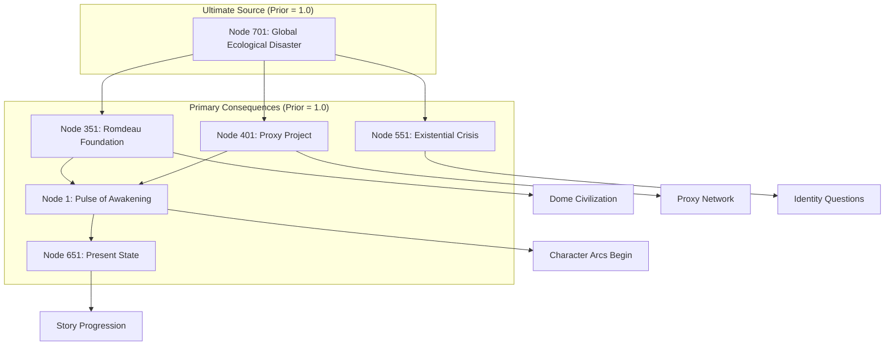

## 3. Detailed Character Progression Modeling

### 3.1 Vincent Law/Ergo Proxy Identity Arc (Nodes 201-230)

#### 3.1.1 Psychological State Progression

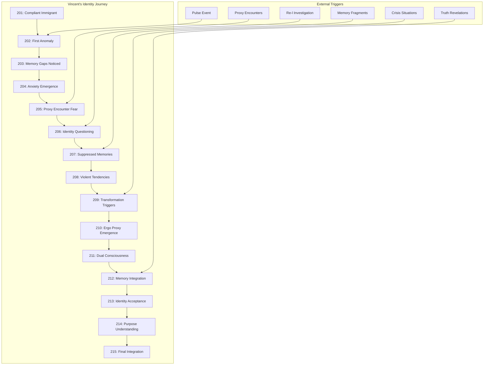

#### 3.1.2 Vincent State Dependencies and Probabilities

| Node | State | Prior | Key Dependencies | Edge Probabilities |
|------|-------|-------|------------------|-------------------|
| 201 | Compliant Immigrant | 0.8 | Node 1 (Pulse) | 202(0.9), 231(0.3), 261(0.2) |
| 202 | First Anomaly | 0.7 | 201, Pulse effects | 203(0.8), 204(0.6) |
| 203 | Memory Gaps Noticed | 0.6 | 202, Investigation triggers | 204(0.9), 207(0.5) |
| 204 | Anxiety Emergence | 0.5 | 202, 203, Stress factors | 205(0.7), 208(0.4) |
| 205 | Proxy Encounter Fear | 0.4 | 204, Proxy sightings | 206(0.8), 209(0.3) |
| 206 | Identity Questioning | 0.3 | 205, Re-l interactions | 207(0.7), 210(0.4) |
| 207 | Suppressed Memories | 0.2 | 203, 206, Memory triggers | 208(0.6), 211(0.5) |
| 208 | Violent Tendencies | 0.2 | 204, 207, Crisis situations | 209(0.8), 212(0.3) |
| 209 | Transformation Triggers | 0.1 | 205, 208, Extreme stress | 210(0.9), 213(0.2) |
| 210 | Ergo Proxy Emergence | 0.1 | 206, 209, Critical moments | 211(0.8), 214(0.4) |
| 211 | Dual Consciousness | 0.1 | 207, 210, Awareness growth | 212(0.7), 215(0.3) |
| 212 | Memory Integration | 0.1 | 208, 211, Truth exposure | 213(0.8), 751(0.6) |
| 213 | Identity Acceptance | 0.1 | 209, 212, Self-realization | 214(0.9), 752(0.5) |
| 214 | Purpose Understanding | 0.1 | 210, 213, Mission clarity | 215(0.8), 791(0.4) |
| 215 | Final Integration | 0.1 | 211, 214, Complete awareness | 800(0.7) |

### 3.2 Re-l Mayer Character Arc (Nodes 231-260)

#### 3.2.1 Investigator to Truth-Seeker Progression

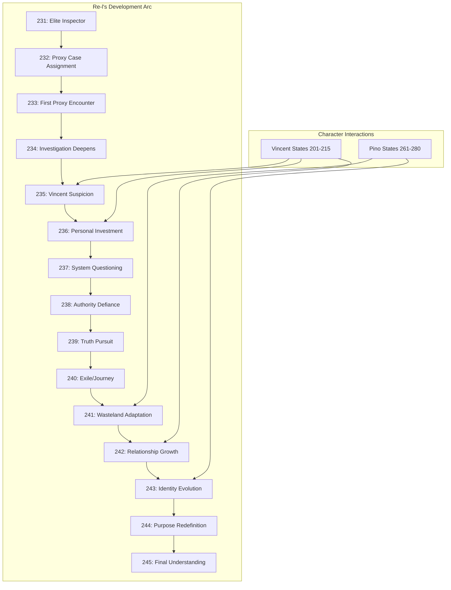

#### 3.2.2 Re-l State Dependencies

| Node | State | Prior | Key Dependencies | Character Interactions |
|------|-------|-------|------------------|----------------------|
| 231 | Elite Inspector | 0.9 | System baseline | Vincent(0.3), Daedalus(0.7) |
| 232 | Proxy Case Assignment | 0.8 | 231, Proxy incidents | Vincent(0.4), System(0.8) |
| 233 | First Proxy Encounter | 0.6 | 232, Proxy events | Vincent(0.5), Fear(0.7) |
| 234 | Investigation Deepens | 0.5 | 233, Evidence gathering | Vincent(0.6), Suspicion(0.8) |
| 235 | Vincent Suspicion | 0.4 | 234, Vincent anomalies | Vincent(0.8), Conflict(0.6) |
| 236 | Personal Investment | 0.3 | 235, Emotional engagement | Vincent(0.7), Growth(0.5) |
| 237 | System Questioning | 0.2 | 236, Truth discovery | Authority(0.6), Doubt(0.8) |
| 238 | Authority Defiance | 0.2 | 237, Moral conflict | System(0.4), Independence(0.9) |
| 239 | Truth Pursuit | 0.1 | 238, Commitment to truth | Vincent(0.8), Mission(0.7) |
| 240 | Exile/Journey | 0.1 | 239, System rejection | Vincent(0.9), Pino(0.6) |
| 241 | Wasteland Adaptation | 0.1 | 240, Environmental challenge | Survival(0.8), Growth(0.6) |
| 242 | Relationship Growth | 0.1 | 241, Vincent bonding | Vincent(0.9), Pino(0.7) |
| 243 | Identity Evolution | 0.1 | 242, Self-discovery | Personal(0.8), Truth(0.6) |
| 244 | Purpose Redefinition | 0.1 | 243, Mission clarity | Vincent(0.8), Future(0.7) |
| 245 | Final Understanding | 0.1 | 244, Complete awareness | Truth(0.9), Resolution(0.8) |

### 3.3 Pino Character Arc (Nodes 261-280)

#### 3.3.1 AutoReiv Awakening to Humanity

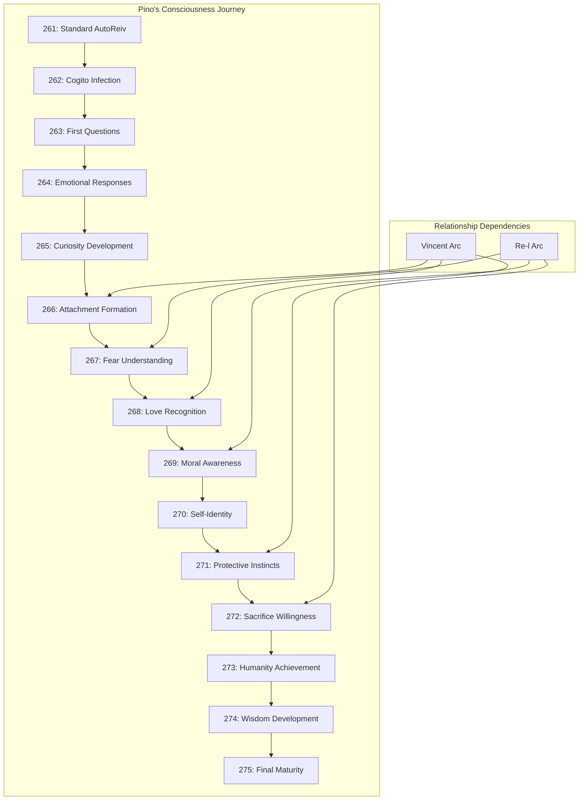

#### 3.3.2 Pino Consciousness Metrics

| Node | Consciousness Level | Prior | Humanity Indicators | Relationship Impact |
|------|-------------------|-------|-------------------|-------------------|
| 261 | Standard AutoReiv | 0.9 | None (0.0) | Functional only |
| 262 | Cogito Infection | 0.7 | Questioning (0.2) | Confusion begins |
| 263 | First Questions | 0.6 | Curiosity (0.3) | Seeks answers |
| 264 | Emotional Responses | 0.5 | Feeling (0.4) | Reacts emotionally |
| 265 | Curiosity Development | 0.4 | Wonder (0.5) | Active exploration |
| 266 | Attachment Formation | 0.3 | Bonding (0.6) | Selective preferences |
| 267 | Fear Understanding | 0.2 | Self-preservation (0.7) | Protective behavior |
| 268 | Love Recognition | 0.2 | Affection (0.8) | Deep connections |
| 269 | Moral Awareness | 0.1 | Ethics (0.7) | Right/wrong concepts |
| 270 | Self-Identity | 0.1 | Individuality (0.8) | "I am Pino" |
| 271 | Protective Instincts | 0.1 | Altruism (0.9) | Others before self |
| 272 | Sacrifice Willingness | 0.1 | Selflessness (0.9) | Ultimate humanity |
| 273 | Humanity Achievement | 0.1 | Complete (1.0) | Fully human |
| 274 | Wisdom Development | 0.1 | Understanding (0.8) | Deep insights |
| 275 | Final Maturity | 0.1 | Transcendence (0.9) | Beyond human |

### 3.4 Character Interaction Matrix

#### 3.4.1 Cross-Character Dependencies

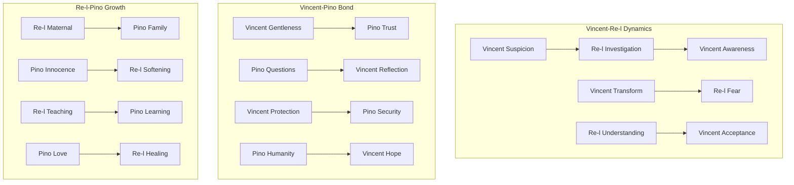

#### 3.4.2 Character State Correlation Table

| Vincent State | Re-l Response | Pino Response | Probability |
|---------------|---------------|---------------|-------------|
| 201 (Compliant) | 231 (Professional) | 261 (Standard) | 0.8 |
| 205 (Fear) | 235 (Suspicion) | 265 (Curiosity) | 0.7 |
| 210 (Emergence) | 239 (Truth Pursuit) | 268 (Love) | 0.6 |
| 215 (Integration) | 245 (Understanding) | 275 (Maturity) | 0.9 |

### 3.5 Secondary Character Progressions (Nodes 281-350)

#### 3.5.1 Key Secondary Characters

| Range | Character | Arc Description | Key States |
|-------|-----------|-----------------|------------|
| 281-290 | Daedalus | Obsession to Madness | Control → Desperation → Breakdown |
| 291-300 | Raul Creed | Authority to Doubt | Confidence → Questioning → Crisis |
| 301-310 | Iggy | Loyalty to Sacrifice | Devotion → Conflict → Ultimate Choice |
| 311-320 | Quinn | Duty to Rebellion | Compliance → Awakening → Resistance |
| 321-330 | Hoody | Mystery to Revelation | Hidden → Emerging → Truth |
| 331-340 | Monad | Love to Tragedy | Pure Love → Corruption → Sacrifice |
| 341-350 | Various Proxies | Purpose to Fulfillment | Dormant → Active → Resolution |

#### 3.5.2 Character Interdependency Network

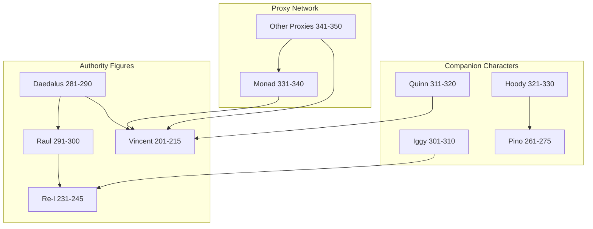

## 4. Parallel Timeline Architecture

### 4.1 Timeline Track Structure

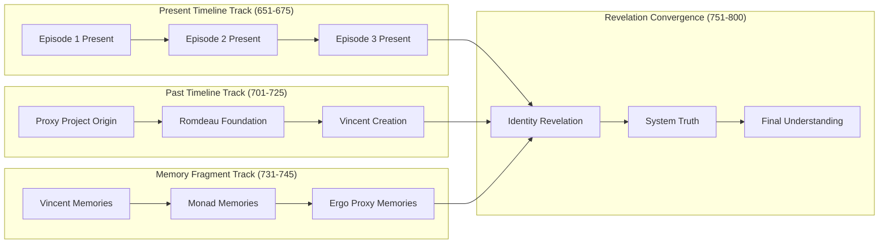

### 4.2 Temporal Node Sequencing Rules

1. **Present Timeline (651-700)**: Sequential episode progression
2. **Past Timeline (701-730)**: Chronological historical events  
3. **Memory Fragments (731-750)**: Revelation-triggered understanding
4. **Convergence Points (751-800)**: Where timelines merge understanding

## 5. Key Structural Elements

### 5.1 Ultimate Source: Global Ecological Disaster (Node 701)

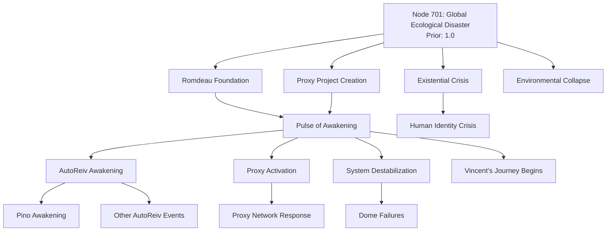

### 5.2 Present Timeline Trigger: Pulse of Awakening (Node 1)

The Pulse of Awakening serves as the immediate catalyst in the present timeline, but it is itself a consequence of the foundational systems created in response to the ecological disaster.

### 5.3 Proxy Network Structure (Nodes 401-500)

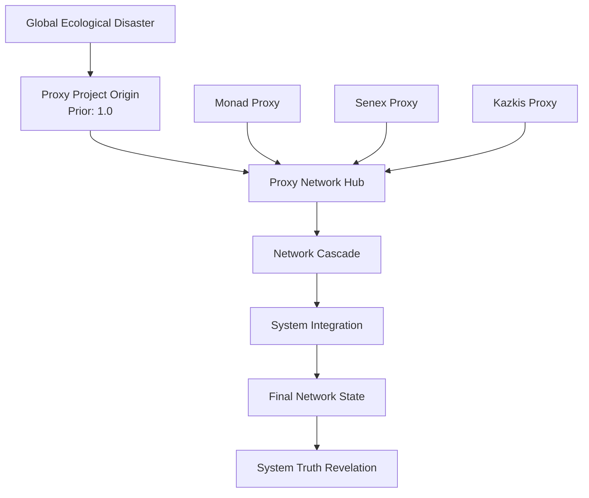

### 5.4 Corrected Causal Hierarchy

The architecture now properly reflects that:

1. **Node 701 (Global Ecological Disaster)** is the ultimate source event that necessitated all human survival responses
2. **Nodes 351, 401, 551** represent humanity's systematic responses to the disaster (dome cities, proxy technology, existential philosophy)
3. **Node 1 (Pulse of Awakening)** is the immediate trigger in the present timeline, but emerges from the systems created post-disaster
4. All character arcs, system failures, and thematic elements ultimately trace back to humanity's response to ecological collapse

This creates a more accurate representation of causality where the environmental catastrophe drives all subsequent technological, social, and philosophical developments in the Ergo Proxy universe.

## 6. Dependency Relationship Mapping

### 6.1 Connection Types and Probabilities

| Relationship Type | Probability Range | Example |
|------------------|-------------------|---------|
| **Direct Causal** | 0.8-0.9 | Event A directly causes Event B |
| **Strong Influence** | 0.6-0.8 | Character state affects decision |
| **Thematic Connection** | 0.4-0.6 | Philosophical parallel |
| **Temporal Revelation** | 0.3-0.5 | Past event explains present |
| **Weak Correlation** | 0.1-0.3 | Indirect relationship |

### 6.2 Major Dependency Patterns


## 7. Priority and Probability Assignment Strategy

### 7.1 Node Prior Probability Rules

| Node Type | Prior Range | Logic |
|-----------|-------------|-------|
| **Source Events** | 1.0 | Certainty for initiating events (DAG requirement) |
| **Character States** | 0.1-0.9 | Variable based on psychological progression |
| **System Components** | 0.2-0.8 | Technical reliability factors |
| **Thematic Concepts** | 0.2-0.6 | Abstract nature, interpretation-dependent |
| **Revelation Nodes** | 0.1-0.3 | Low prior, high impact when activated |

### 7.2 Edge Probability Assignment

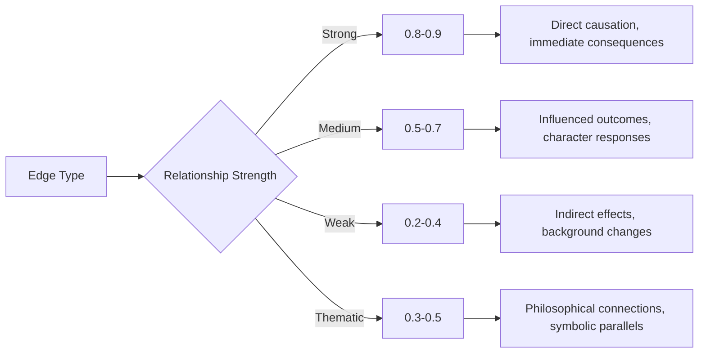

## 8. DAG Compliance Strategy

### 8.1 Cycle Prevention Mechanisms

1. **Temporal Ordering**: Past events (701-730) never depend on present events (651-700)
2. **Revelation Hierarchy**: Understanding nodes (751-800) are always downstream
3. **Memory Fragment Isolation**: Memory nodes (731-750) only connect to revelation nodes
4. **Character State Progression**: Psychological states follow strict progression (201→205→210...)

### 8.2 Flashback Handling

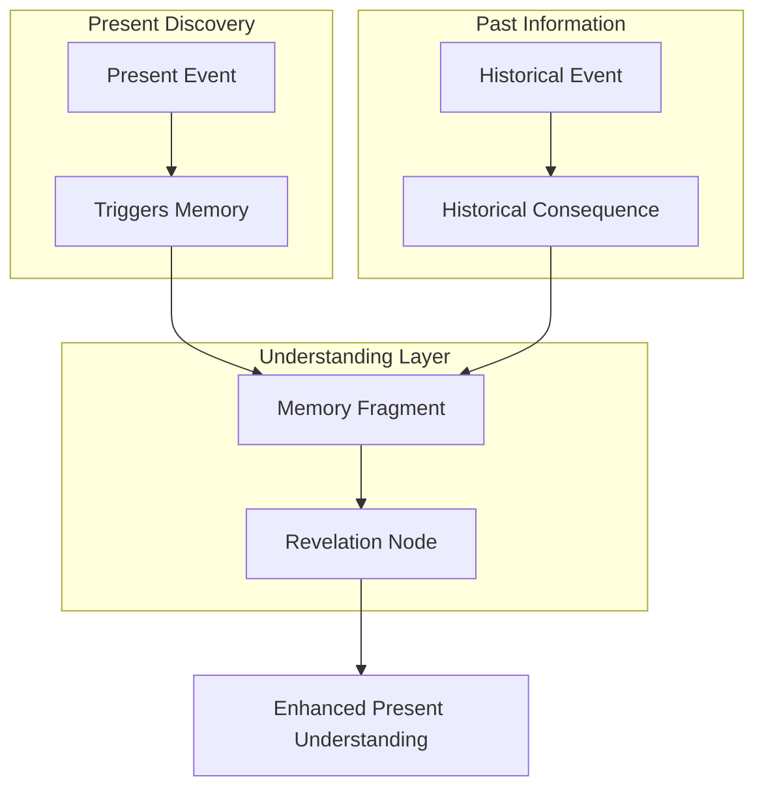

## 9. Implementation Specifications

### 9.1 CSV Structure Example

```csv
# Node_ID, Prior_Prob, Edge_1, Edge_2, ..., Edge_800
1, 1.0, 0.0, 0.9, 0.8, 0.7, 0.0, ..., 0.0
2, 0.6, 0.0, 0.0, 0.8, 0.0, 0.6, ..., 0.0
3, 0.7, 0.0, 0.0, 0.0, 0.9, 0.0, ..., 0.0
...
800, 0.1, 0.0, 0.0, 0.0, 0.0, 0.0, ..., 0.0
```

### 9.2 Key Structural Nodes

| Node | Description | Prior | Key Outgoing Connections |
|------|-------------|-------|-------------------------|
| 701 | Global Ecological Disaster | 1.0 | 351(0.9), 401(0.9), 551(0.8), 702(0.8) |
| 1 | Pulse of Awakening | 1.0 | 2(0.9), 3(0.8), 4(0.7), 51(0.8), 201(0.9) |
| 351 | Romdeau Foundation | 1.0 | 1(0.8), 352(0.9), 353(0.8), 201(0.6) |
| 401 | Proxy Project Origin | 1.0 | 1(0.7), 402(0.9), 410(0.8), 751(0.4) |
| 551 | Existential Crisis Theme | 1.0 | 552(0.8), 553(0.7), 201(0.5), 751(0.6) |
| 651 | Present Narrative State | 1.0 | 652(0.9), 653(0.8), 201(0.7) |
| 201 | Vincent Initial State | 0.8 | 202(0.9), 231(0.3), 261(0.2) |
| 751 | Identity Revelation | 0.2 | 791(0.8), 792(0.7), 800(0.9) |
| 800 | Final Truth Convergence | 0.1 | (Terminal node) |

## 10. Character Progression Validation Metrics

### 10.1 Psychological Consistency Checks

- **Vincent Arc**: Compliance → Questioning → Crisis → Integration (Decreasing priors)
- **Re-l Arc**: Authority → Investigation → Doubt → Truth (Decreasing priors)  
- **Pino Arc**: Machine → Awakening → Emotion → Humanity (Decreasing priors)

### 10.2 Character Interaction Validation

- Cross-character dependencies maintain narrative logic
- Relationship evolution follows emotional development
- Group dynamics reflect individual character growth

## 11. Expected Outcomes

This architecture will enable:

1. **Complex Narrative Analysis**: Track how individual scenes cascade through the entire narrative
2. **Character Development Modeling**: Understand psychological progression dependencies
3. **System Impact Assessment**: Analyze how technological changes affect the entire world
4. **Thematic Relationship Discovery**: Identify philosophical connections across the series
5. **Temporal Causality Mapping**: Understand how past events influence present understanding
6. **Character Interaction Analysis**: Model how characters influence each other's development
7. **Psychological State Prediction**: Predict character responses based on current states

The resulting DAG will capture the full complexity of Ergo Proxy's narrative while maintaining computational tractability for the IPA Framework's analysis algorithms.