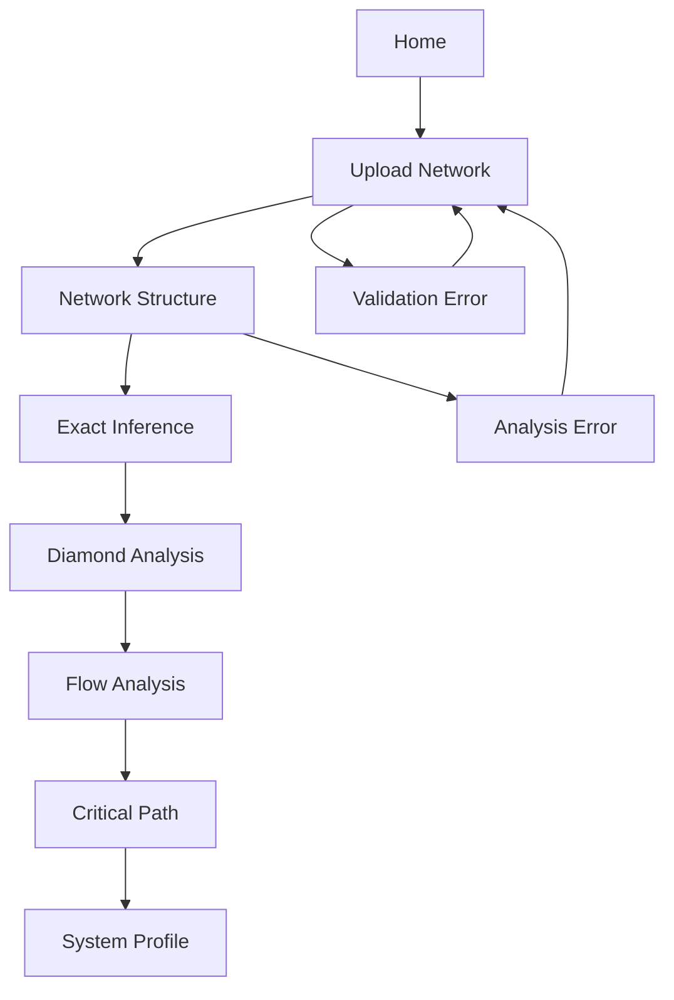

# Angular Enterprise Network Analysis Application - Frontend Architecture Plan

## Executive Summary

This document outlines the comprehensive frontend architecture for an Angular enterprise network analysis application that interfaces with a Julia backend server. The application targets non-technical users and provides sophisticated network analysis capabilities through an intuitive, accessible interface.

## 1. Current Application Analysis

### Existing Infrastructure
- **Framework**: Angular 20.1.0 with standalone components
- **UI Library**: Angular Material 20.2.0
- **Visualization**: D3.js 7.9.0 for network graphs
- **Build System**: Nx workspace 21.4.1
- **Styling**: SCSS with component-level styles
- **HTTP Client**: Angular HttpClient with fetch API

### Current Route Structure
```typescript
// Existing routes from app.routes.ts
- /home (HomeComponent)
- /upload (UploadNetworkComponent)
- /structure (NetworkStructureComponent)
- /diamonds (DiamondAnalysisComponent)
- /exact-inference (ReachabilityAnalysisComponent)
- /flow (FlowAnalysisComponent)
- /critical-path (CriticalPathComponent)
- /system-profile (SystemProfileComponent)
```

### Current Components
- Navigation sidebar with progress tracking
- Material Design components (sidenav, toolbar, nav-list)
- Theme toggle functionality (light/dark mode)
- Progress tracking system for analysis steps

## 2. Backend API Integration Analysis

### API Endpoints
- **Health Check**: `GET /health`
- **Network Analysis**: `POST /analyze`

### Response Structure Analysis
Based on the backend server code, the `/analyze` endpoint returns:

```typescript
interface AnalysisResponse {
  network_structure: NetworkStructure;
  reachability_scenarios?: Record<string, ReachabilityScenario>;
  diamond_analysis?: DiamondAnalysis;
  capacity_scenarios?: Record<string, CapacityScenario>;
  cpm_scenarios?: Record<string, CpmScenario>;
  computation_summary: ComputationSummary;
}

interface NetworkStructure {
  computation_time: number;
  total_nodes: number;
  total_edges: number;
  nodes: number[];
  edges: [number, number][];
  source_nodes: number[];
  sink_nodes: number[];
  fork_nodes: number[];
  join_nodes: number[];
  iteration_sets: number[][];
  iteration_sets_count: number;
  ancestors: Record<string, number[]>;
  descendants: Record<string, number[]>;
  outgoing_index: Record<string, number[]>;
  incoming_index: Record<string, number[]>;
}

interface ReachabilityScenario {
  diamond_analysis?: DiamondAnalysisResult;
  exact_inference?: ExactInferenceResult;
  scenario_computation_time: number;
  input_files: {
    nodepriors_path: string;
    linkprobs_path: string;
  };
}

interface ExactInferenceResult {
  beliefs: Record<string, number>;
  computation_time: number;
  total_nodes_processed: number;
  belief_statistics: {
    mean: number;
    min: number;
    max: number;
  };
}

interface CapacityScenario {
  computation_time: number;
  network_utilization: number;
  total_source_input: number;
  total_target_output: number;
  target_flows: Record<string, number>;
  active_sources: number[];
  target_nodes: number[];
  node_capacities_count: number;
  edge_capacities_count: number;
}

interface CpmScenario {
  computation_time: number;
  time_result: {
    critical_value: number;
    critical_nodes: number[];
    node_values: Record<string, number>;
  };
  cost_result: {
    critical_value: number;
    critical_nodes: number[];
    node_values: Record<string, number>;
  };
}
```

## 3. Service Architecture Design

### Core Services

#### 3.1 NetworkAnalysisService
```typescript
@Injectable({ providedIn: 'root' })
export class NetworkAnalysisService {
  private readonly apiUrl = 'http://localhost:8080';
  
  // Health check
  checkHealth(): Observable<HealthResponse>
  
  // Multi-scenario analysis
  analyzeNetwork(request: AnalysisRequest): Observable<AnalysisResponse>
  
  // Upload network files
  uploadNetworkFiles(files: FileList): Observable<UploadResponse>
}

interface AnalysisRequest {
  networkPath: string;
  reachabilityScenarios: ReachabilityScenarioConfig[];
  capacityScenarios: CapacityScenarioConfig[];
  cpmScenarios: CpmScenarioConfig[];
  analysisConfig: {
    exactInference: boolean;
    diamondAnalysis: boolean;
    flowAnalysis: boolean;
    criticalPath: boolean;
  };
}
```

#### 3.2 DataVisualizationService
```typescript
@Injectable({ providedIn: 'root' })
export class DataVisualizationService {
  // Network graph visualization
  createNetworkGraph(data: NetworkStructure, container: HTMLElement): NetworkGraph
  
  // Update graph with analysis results
  updateGraphWithBeliefs(graph: NetworkGraph, beliefs: Record<string, number>): void
  updateGraphWithFlows(graph: NetworkGraph, flows: Record<string, number>): void
  updateGraphWithCriticalPath(graph: NetworkGraph, criticalNodes: number[]): void
  
  // Chart generation
  createBeliefDistributionChart(beliefs: Record<string, number>): ChartConfig
  createFlowAnalysisChart(flows: Record<string, number>): ChartConfig
  createTimelineChart(timeData: Record<string, number>): ChartConfig
}
```

#### 3.3 StateManagementService
```typescript
@Injectable({ providedIn: 'root' })
export class StateManagementService {
  // Analysis state management
  private analysisState = signal<AnalysisState>({
    currentStep: 'upload',
    completedSteps: new Set(),
    networkData: null,
    analysisResults: null,
    isLoading: false,
    error: null
  });
  
  // Computed signals
  readonly currentStep = computed(() => this.analysisState().currentStep);
  readonly isStepCompleted = (step: string) => computed(() => 
    this.analysisState().completedSteps.has(step)
  );
  readonly overallProgress = computed(() => 
    this.analysisState().completedSteps.size / this.getTotalSteps()
  );
  
  // State mutations
  setCurrentStep(step: string): void
  markStepCompleted(step: string): void
  setNetworkData(data: NetworkStructure): void
  setAnalysisResults(results: AnalysisResponse): void
  setLoading(loading: boolean): void
  setError(error: string | null): void
}
```

#### 3.4 ThemeService
```typescript
@Injectable({ providedIn: 'root' })
export class ThemeService {
  private isDarkMode = signal(false);
  
  readonly currentTheme = computed(() => 
    this.isDarkMode() ? 'dark-theme' : 'light-theme'
  );
  
  toggleTheme(): void
  setTheme(isDark: boolean): void
  initializeTheme(): void
}
```

#### 3.5 AccessibilityService
```typescript
@Injectable({ providedIn: 'root' })
export class AccessibilityService {
  // Screen reader announcements
  announceToScreenReader(message: string): void
  
  // High contrast mode detection
  isHighContrastMode(): boolean
  
  // Keyboard navigation helpers
  trapFocus(element: HTMLElement): void
  releaseFocus(): void
  
  // ARIA label generation
  generateAriaLabel(context: string, data: any): string
}
```

## 4. Component Architecture

### 4.1 Component Hierarchy

```
AppComponent
├── NavigationComponent
│   ├── ProgressIndicatorComponent
│   ├── NetworkSummaryComponent
│   └── NavigationMenuComponent
├── MainContentComponent
│   ├── HomeComponent
│   ├── UploadComponent
│   │   ├── FileUploadComponent
│   │   ├── NetworkValidationComponent
│   │   └── UploadProgressComponent
│   ├── AnalysisComponents/
│   │   ├── NetworkStructureComponent
│   │   │   ├── NetworkGraphComponent
│   │   │   ├── NodeStatisticsComponent
│   │   │   └── EdgeStatisticsComponent
│   │   ├── ExactInferenceComponent
│   │   │   ├── BeliefVisualizationComponent
│   │   │   ├── BeliefStatisticsComponent
│   │   │   └── ScenarioComparisonComponent
│   │   ├── DiamondAnalysisComponent
│   │   │   ├── DiamondVisualizationComponent
│   │   │   ├── DiamondClassificationComponent
│   │   │   └── OptimizationInsightsComponent
│   │   ├── FlowAnalysisComponent
│   │   │   ├── FlowVisualizationComponent
│   │   │   ├── CapacityUtilizationComponent
│   │   │   └── BottleneckAnalysisComponent
│   │   └── CriticalPathComponent
│   │       ├── TimelineVisualizationComponent
│   │       ├── CostAnalysisComponent
│   │       └── PathOptimizationComponent
│   └── SharedComponents/
│       ├── LoadingSpinnerComponent
│       ├── ErrorDisplayComponent
│       ├── DataTableComponent
│       ├── ChartContainerComponent
│       └── ExportButtonComponent
└── FooterComponent
```

### 4.2 Key Component Specifications

#### NetworkGraphComponent
```typescript
@Component({
  selector: 'app-network-graph',
  template: `
    <div class="graph-container" 
         [attr.aria-label]="graphAriaLabel"
         role="img">
      <svg #graphSvg class="network-graph"></svg>
      <div class="graph-controls">
        <button mat-icon-button (click)="zoomIn()" 
                [attr.aria-label]="'Zoom in'">
          <mat-icon>zoom_in</mat-icon>
        </button>
        <button mat-icon-button (click)="zoomOut()" 
                [attr.aria-label]="'Zoom out'">
          <mat-icon>zoom_out</mat-icon>
        </button>
        <button mat-icon-button (click)="resetZoom()" 
                [attr.aria-label]="'Reset zoom'">
          <mat-icon>center_focus_strong</mat-icon>
        </button>
      </div>
    </div>
  `
})
export class NetworkGraphComponent implements OnInit, OnDestroy {
  @Input() networkData: NetworkStructure;
  @Input() analysisResults: AnalysisResponse | null = null;
  @Input() visualizationMode: 'structure' | 'beliefs' | 'flows' | 'critical-path' = 'structure';
  
  @ViewChild('graphSvg', { static: true }) svgElement: ElementRef<SVGElement>;
  
  private d3Graph: NetworkGraph;
  private resizeObserver: ResizeObserver;
  
  ngOnInit(): void {
    this.initializeGraph();
    this.setupResizeObserver();
  }
  
  private initializeGraph(): void {
    // D3.js network graph initialization
  }
  
  private updateVisualization(): void {
    // Update graph based on current visualization mode
  }
}
```

#### BeliefVisualizationComponent
```typescript
@Component({
  selector: 'app-belief-visualization',
  template: `
    <mat-card class="belief-card">
      <mat-card-header>
        <mat-card-title>Node Belief Analysis</mat-card-title>
        <mat-card-subtitle>
          Exact inference results for {{scenarioName}}
        </mat-card-subtitle>
      </mat-card-header>
      <mat-card-content>
        <div class="visualization-container">
          <app-network-graph 
            [networkData]="networkData"
            [analysisResults]="analysisResults"
            visualizationMode="beliefs">
          </app-network-graph>
        </div>
        <div class="statistics-panel">
          <app-belief-statistics [beliefs]="beliefs"></app-belief-statistics>
        </div>
      </mat-card-content>
    </mat-card>
  `
})
export class BeliefVisualizationComponent {
  @Input() networkData: NetworkStructure;
  @Input() analysisResults: AnalysisResponse;
  @Input() scenarioName: string;
  
  get beliefs(): Record<string, number> {
    return this.analysisResults?.reachability_scenarios?.[this.scenarioName]?.exact_inference?.beliefs || {};
  }
}
```

## 5. Styling System & Accessibility

### 5.1 Design System Structure

```scss
// src/styles/design-system/
├── _variables.scss          // Design tokens
├── _typography.scss         // Font system
├── _colors.scss            // Color palette
├── _spacing.scss           // Spacing system
├── _elevation.scss         // Shadow system
├── _breakpoints.scss       // Responsive breakpoints
└── _accessibility.scss     // A11y utilities

// src/styles/themes/
├── _light-theme.scss       // Light mode variables
├── _dark-theme.scss        // Dark mode variables
└── _high-contrast.scss     // High contrast mode
```

### 5.2 Color System
```scss
// Light Theme
$light-theme: (
  primary: #1976d2,
  primary-variant: #1565c0,
  secondary: #03dac6,
  background: #ffffff,
  surface: #f5f5f5,
  error: #b00020,
  on-primary: #ffffff,
  on-secondary: #000000,
  on-background: #000000,
  on-surface: #000000,
  on-error: #ffffff,
  
  // Network visualization colors
  node-default: #90a4ae,
  node-source: #4caf50,
  node-sink: #f44336,
  node-fork: #ff9800,
  node-join: #9c27b0,
  edge-default: #bdbdbd,
  edge-critical: #f44336,
  
  // Analysis result colors
  belief-high: #4caf50,
  belief-medium: #ff9800,
  belief-low: #f44336,
  flow-high: #2196f3,
  flow-medium: #03dac6,
  flow-low: #9e9e9e
);

// Dark Theme
$dark-theme: (
  primary: #bb86fc,
  primary-variant: #3700b3,
  secondary: #03dac6,
  background: #121212,
  surface: #1e1e1e,
  error: #cf6679,
  on-primary: #000000,
  on-secondary: #000000,
  on-background: #ffffff,
  on-surface: #ffffff,
  on-error: #000000,
  
  // Network visualization colors (adjusted for dark mode)
  node-default: #616161,
  node-source: #66bb6a,
  node-sink: #ef5350,
  node-fork: #ffb74d,
  node-join: #ba68c8,
  edge-default: #757575,
  edge-critical: #ef5350,
  
  // Analysis result colors (adjusted for dark mode)
  belief-high: #66bb6a,
  belief-medium: #ffb74d,
  belief-low: #ef5350,
  flow-high: #42a5f5,
  flow-medium: #26c6da,
  flow-low: #bdbdbd
);
```

### 5.3 Accessibility Features
```scss
// High contrast mode
@media (prefers-contrast: high) {
  .high-contrast {
    --primary-color: #000000;
    --background-color: #ffffff;
    --text-color: #000000;
    --border-color: #000000;
    
    .network-graph {
      .node { stroke-width: 3px; }
      .edge { stroke-width: 2px; }
    }
  }
}

// Reduced motion
@media (prefers-reduced-motion: reduce) {
  * {
    animation-duration: 0.01ms !important;
    animation-iteration-count: 1 !important;
    transition-duration: 0.01ms !important;
  }
}

// Focus indicators
.focus-visible {
  outline: 2px solid var(--primary-color);
  outline-offset: 2px;
}

// Screen reader only content
.sr-only {
  position: absolute;
  width: 1px;
  height: 1px;
  padding: 0;
  margin: -1px;
  overflow: hidden;
  clip: rect(0, 0, 0, 0);
  white-space: nowrap;
  border: 0;
}
```

## 6. Data Visualization Strategy

### 6.1 Network Graph Visualization
```typescript
interface NetworkGraphConfig {
  // Node visualization
  nodeRadius: (node: NetworkNode) => number;
  nodeColor: (node: NetworkNode, mode: VisualizationMode) => string;
  nodeLabel: (node: NetworkNode) => string;
  
  // Edge visualization
  edgeWidth: (edge: NetworkEdge, mode: VisualizationMode) => number;
  edgeColor: (edge: NetworkEdge, mode: VisualizationMode) => string;
  edgeOpacity: (edge: NetworkEdge) => number;
  
  // Layout
  forceStrength: number;
  linkDistance: number;
  chargeStrength: number;
}

class NetworkGraphRenderer {
  private svg: d3.Selection<SVGElement, unknown, null, undefined>;
  private simulation: d3.Simulation<NetworkNode, NetworkEdge>;
  
  constructor(container: HTMLElement, config: NetworkGraphConfig) {
    this.initializeSVG(container);
    this.setupSimulation(config);
  }
  
  updateVisualization(mode: VisualizationMode, data: AnalysisResults): void {
    switch (mode) {
      case 'beliefs':
        this.renderBeliefVisualization(data.beliefs);
        break;
      case 'flows':
        this.renderFlowVisualization(data.flows);
        break;
      case 'critical-path':
        this.renderCriticalPathVisualization(data.criticalPath);
        break;
    }
  }
  
  private renderBeliefVisualization(beliefs: Record<string, number>): void {
    // Color nodes based on belief values
    // Add belief value labels
    // Highlight high-belief paths
  }
}
```

### 6.2 Chart Components
```typescript
// Belief distribution chart
interface BeliefChartData {
  nodeId: number;
  belief: number;
  nodeType: 'source' | 'sink' | 'fork' | 'join' | 'regular';
}

// Flow analysis chart
interface FlowChartData {
  nodeId: number;
  inFlow: number;
  outFlow: number;
  capacity: number;
  utilization: number;
}

// Timeline chart for critical path
interface TimelineData {
  nodeId: number;
  startTime: number;
  duration: number;
  endTime: number;
  isCritical: boolean;
}
```

## 7. User Experience Flow

### 7.1 Navigation Flow


### 7.2 Progressive Disclosure
1. **Level 1**: High-level summary cards
2. **Level 2**: Detailed visualizations
3. **Level 3**: Raw data tables and export options

### 7.3 Error Handling
```typescript
interface ErrorState {
  type: 'network' | 'validation' | 'analysis' | 'visualization';
  message: string;
  details?: string;
  recoveryActions: RecoveryAction[];
}

interface RecoveryAction {
  label: string;
  action: () => void;
  isPrimary: boolean;
}
```

## 8. Technical Implementation Strategy

### 8.1 Angular Patterns
- **Standalone Components**: Continue using standalone components for better tree-shaking
- **Signals**: Use Angular signals for reactive state management
- **OnPush Change Detection**: Optimize performance with OnPush strategy
- **Lazy Loading**: Implement route-based code splitting
- **Service Workers**: Add offline capability for uploaded networks

### 8.2 Performance Optimizations
```typescript
// Virtual scrolling for large datasets
@Component({
  template: `
    <cdk-virtual-scroll-viewport itemSize="50" class="data-viewport">
      <div *cdkVirtualFor="let item of largeDataset">{{item}}</div>
    </cdk-virtual-scroll-viewport>
  `
})
export class LargeDataTableComponent {}

// Intersection Observer for lazy loading
@Directive({
  selector: '[appLazyLoad]'
})
export class LazyLoadDirective implements OnInit {
  @Input() appLazyLoad: () => void;
  
  ngOnInit(): void {
    const observer = new IntersectionObserver((entries) => {
      if (entries[0].isIntersecting) {
        this.appLazyLoad();
        observer.disconnect();
      }
    });
    observer.observe(this.elementRef.nativeElement);
  }
}
```

### 8.3 Testing Strategy
```typescript
// Component testing with Angular Testing Library
describe('NetworkGraphComponent', () => {
  it('should render network nodes correctly', async () => {
    const { fixture } = await render(NetworkGraphComponent, {
      componentInputs: {
        networkData: mockNetworkData,
        visualizationMode: 'structure'
      }
    });
    
    expect(screen.getAllByRole('img')).toHaveLength(mockNetworkData.nodes.length);
  });
  
  it('should be accessible to screen readers', async () => {
    const { fixture } = await render(NetworkGraphComponent, {
      componentInputs: { networkData: mockNetworkData }
    });
    
    expect(screen.getByLabelText(/network graph/i)).toBeInTheDocument();
  });
});

// Service testing
describe('NetworkAnalysisService', () => {
  it('should handle analysis request correctly', () => {
    const service = TestBed.inject(NetworkAnalysisService);
    const httpMock = TestBed.inject(HttpTestingController);
    
    service.analyzeNetwork(mockRequest).subscribe(response => {
      expect(response.network_structure).toBeDefined();
    });
    
    const req = httpMock.expectOne('http://localhost:8080/analyze');
    expect(req.request.method).toBe('POST');
    req.flush(mockAnalysisResponse);
  });
});
```

## 9. Implementation Phases

### Phase 1: Foundation (Weeks 1-2)
- [ ] Set up enhanced service architecture
- [ ] Implement state management with signals
- [ ] Create base component structure
- [ ] Establish design system and theming

### Phase 2: Core Visualization (Weeks 3-4)
- [ ] Implement NetworkGraphComponent with D3.js
- [ ] Create basic chart components
- [ ] Add responsive design and accessibility features
- [ ] Implement error handling and loading states

### Phase 3: Analysis Components (Weeks 5-6)
- [ ] Build exact inference visualization
- [ ] Implement diamond analysis display
- [ ] Create flow analysis components
- [ ] Add critical path visualization

### Phase 4: Polish & Optimization (Weeks 7-8)
- [ ] Performance optimization
- [ ] Comprehensive testing
- [ ] Documentation and user guides
- [ ] Deployment preparation

## 10. Success Metrics

### Technical Metrics
- **Performance**: < 3s initial load time, < 1s navigation between views
- **Accessibility**: WCAG 2.1 AA compliance, 100% keyboard navigable
- **Browser Support**: Chrome 90+, Firefox 88+, Safari 14+, Edge 90+
- **Mobile Responsiveness**: Functional on tablets (768px+)

### User Experience Metrics
- **Task Completion**: > 90% success rate for core analysis workflows
- **Error Recovery**: < 5% of users abandon after encountering errors
- **Learning Curve**: New users complete first analysis within 10 minutes

## 11. Risk Mitigation

### Technical Risks
- **Large Dataset Performance**: Implement virtual scrolling and data pagination
- **D3.js Complexity**: Create abstraction layer for easier maintenance
- **Backend Dependency**: Add offline mode for previously analyzed networks

### User Experience Risks
- **Complexity Overwhelm**: Progressive disclosure and guided workflows
- **Accessibility Gaps**: Regular accessibility audits and user testing
- **Browser Compatibility**: Comprehensive cross-browser testing

## Conclusion

This architecture provides a solid foundation for building an enterprise-grade network analysis application that balances sophisticated functionality with user-friendly design. The modular approach allows for iterative development while maintaining code quality and accessibility standards.

The key success factors are:
1. **Service-oriented architecture** for clean separation of concerns
2. **Component-based design** for reusability and maintainability
3. **Accessibility-first approach** for inclusive user experience
4. **Performance optimization** for handling complex network data
5. **Progressive enhancement** for graceful degradation

This plan should be reviewed and refined based on user feedback and technical constraints discovered during implementation.