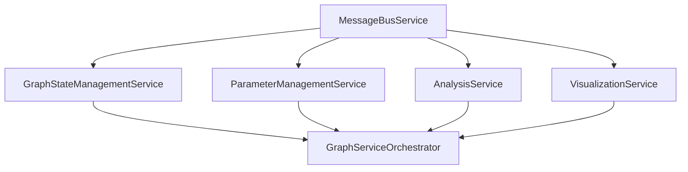

# Service Configuration Guide

## 📋 Overview

This guide provides detailed instructions for configuring the new specialized services architecture, including dependency injection setup, service provider configuration, and environment-specific settings.

## 🔧 Service Configuration

### Core Service Dependencies

The new architecture requires specific service registration order due to dependencies:



### app.config.ts Configuration

```typescript
import { ApplicationConfig, provideBrowserGlobalErrorListeners, provideZoneChangeDetection } from '@angular/core';
import { provideRouter } from '@angular/router';
import { provideHttpClient, withInterceptorsFromDi } from '@angular/common/http';
import { appRoutes } from './app.routes';

// Service imports
import { MessageBusService } from './services/message-bus.service';
import { GraphStateManagementService } from './services/graph-state-management.service';
import { ParameterManagementService } from './services/parameter-management.service';
import { AnalysisService } from './services/analysis.service';
import { VisualizationService } from './services/visualization.service';
import { GraphServiceOrchestrator } from './services/graph-service-orchestrator';

// Optional: Service configuration providers
import { MESSAGE_BUS_CONFIG, PARAMETER_VALIDATION_CONFIG, ANALYSIS_CONFIG } from './config/service-config';

export const appConfig: ApplicationConfig = {
  providers: [
    // Core Angular providers
    provideBrowserGlobalErrorListeners(),
    provideZoneChangeDetection({ eventCoalescing: true }),
    provideRouter(appRoutes),
    provideHttpClient(withInterceptorsFromDi()),
    
    // Service configuration tokens (optional)
    { provide: MESSAGE_BUS_CONFIG, useValue: {
      maxBatchSize: 50,
      maxBatchDelay: 100,
      priorityThreshold: 2,
      enableBatching: true
    }},
    
    { provide: PARAMETER_VALIDATION_CONFIG, useValue: {
      enableRealTimeValidation: true,
      validationDebounceMs: 300,
      maxNodeOverrides: 1000,
      maxEdgeOverrides: 5000
    }},
    
    { provide: ANALYSIS_CONFIG, useValue: {
      defaultTimeout: 30000,
      enableProgressTracking: true,
      enableCancellation: true,
      maxConcurrentOperations: 3
    }},
    
    // Core specialized services (in dependency order)
    MessageBusService,
    GraphStateManagementService,
    ParameterManagementService,
    AnalysisService,
    VisualizationService,
    
    // Orchestrator for backward compatibility
    GraphServiceOrchestrator,
    
    // Legacy service (for gradual migration only)
    // GraphStateService
  ],
};
```

### Service Configuration Tokens

Create `src/app/config/service-config.ts`:

```typescript
import { InjectionToken } from '@angular/core';

// MessageBusService Configuration
export interface MessageBusConfig {
  maxBatchSize: number;
  maxBatchDelay: number;
  priorityThreshold: number;
  enableBatching: boolean;
  enableCorrelationTracking?: boolean;
  maxCorrelationHistory?: number;
}

export const MESSAGE_BUS_CONFIG = new InjectionToken<MessageBusConfig>('MESSAGE_BUS_CONFIG');

// ParameterManagementService Configuration
export interface ParameterValidationConfig {
  enableRealTimeValidation: boolean;
  validationDebounceMs: number;
  maxNodeOverrides: number;
  maxEdgeOverrides: number;
  enablePerformanceWarnings?: boolean;
  strictValidation?: boolean;
}

export const PARAMETER_VALIDATION_CONFIG = new InjectionToken<ParameterValidationConfig>('PARAMETER_VALIDATION_CONFIG');

// AnalysisService Configuration
export interface AnalysisConfig {
  defaultTimeout: number;
  enableProgressTracking: boolean;
  enableCancellation: boolean;
  maxConcurrentOperations: number;
  enableCaching?: boolean;
  cacheSize?: number;
}

export const ANALYSIS_CONFIG = new InjectionToken<AnalysisConfig>('ANALYSIS_CONFIG');

// VisualizationService Configuration
export interface VisualizationConfig {
  defaultLayout: string;
  enableAnimations: boolean;
  animationDuration: number;
  maxNodes: number;
  maxEdges: number;
  enableWebGL?: boolean;
}

export const VISUALIZATION_CONFIG = new InjectionToken<VisualizationConfig>('VISUALIZATION_CONFIG');

// GraphStateManagementService Configuration
export interface StateManagementConfig {
  maxHistorySize: number;
  enableSnapshots: boolean;
  enableStateValidation: boolean;
  enableMetrics?: boolean;
}

export const STATE_MANAGEMENT_CONFIG = new InjectionToken<StateManagementConfig>('STATE_MANAGEMENT_CONFIG');
```

### Environment-Specific Configuration

Create `src/app/config/service-config.development.ts`:

```typescript
import { 
  MessageBusConfig, 
  ParameterValidationConfig, 
  AnalysisConfig,
  VisualizationConfig,
  StateManagementConfig 
} from './service-config';

export const DEVELOPMENT_MESSAGE_BUS_CONFIG: MessageBusConfig = {
  maxBatchSize: 25, // Smaller batches for development
  maxBatchDelay: 50, // Faster processing
  priorityThreshold: 1, // Lower threshold for debugging
  enableBatching: true,
  enableCorrelationTracking: true,
  maxCorrelationHistory: 1000
};

export const DEVELOPMENT_PARAMETER_CONFIG: ParameterValidationConfig = {
  enableRealTimeValidation: true,
  validationDebounceMs: 100, // Faster validation feedback
  maxNodeOverrides: 500, // Lower limits for development
  maxEdgeOverrides: 2000,
  enablePerformanceWarnings: true,
  strictValidation: true
};

export const DEVELOPMENT_ANALYSIS_CONFIG: AnalysisConfig = {
  defaultTimeout: 60000, // Longer timeout for debugging
  enableProgressTracking: true,
  enableCancellation: true,
  maxConcurrentOperations: 2, // Limit for development
  enableCaching: false, // Disable caching for development
  cacheSize: 0
};

export const DEVELOPMENT_VISUALIZATION_CONFIG: VisualizationConfig = {
  defaultLayout: 'hierarchical',
  enableAnimations: true,
  animationDuration: 500,
  maxNodes: 1000, // Development limits
  maxEdges: 5000,
  enableWebGL: false // Disable for compatibility
};

export const DEVELOPMENT_STATE_CONFIG: StateManagementConfig = {
  maxHistorySize: 20, // Smaller history for development
  enableSnapshots: true,
  enableStateValidation: true,
  enableMetrics: true
};
```

Create `src/app/config/service-config.production.ts`:

```typescript
export const PRODUCTION_MESSAGE_BUS_CONFIG: MessageBusConfig = {
  maxBatchSize: 100, // Larger batches for efficiency
  maxBatchDelay: 200, // Optimize for throughput
  priorityThreshold: 2,
  enableBatching: true,
  enableCorrelationTracking: false, // Disable for performance
  maxCorrelationHistory: 500
};

export const PRODUCTION_PARAMETER_CONFIG: ParameterValidationConfig = {
  enableRealTimeValidation: true,
  validationDebounceMs: 500, // Longer debounce for performance
  maxNodeOverrides: 2000, // Production limits
  maxEdgeOverrides: 10000,
  enablePerformanceWarnings: false, // Disable warnings
  strictValidation: false
};

export const PRODUCTION_ANALYSIS_CONFIG: AnalysisConfig = {
  defaultTimeout: 30000, // Standard timeout
  enableProgressTracking: true,
  enableCancellation: true,
  maxConcurrentOperations: 5, // Higher concurrency
  enableCaching: true,
  cacheSize: 100
};

export const PRODUCTION_VISUALIZATION_CONFIG: VisualizationConfig = {
  defaultLayout: 'force-directed',
  enableAnimations: false, // Disable for performance
  animationDuration: 0,
  maxNodes: 5000, // Production limits
  maxEdges: 25000,
  enableWebGL: true // Enable for performance
};

export const PRODUCTION_STATE_CONFIG: StateManagementConfig = {
  maxHistorySize: 50,
  enableSnapshots: true,
  enableStateValidation: false, // Disable for performance
  enableMetrics: false
};
```

### Environment-Aware Configuration

Update `src/environments/environment.ts`:

```typescript
import { 
  DEVELOPMENT_MESSAGE_BUS_CONFIG,
  DEVELOPMENT_PARAMETER_CONFIG,
  DEVELOPMENT_ANALYSIS_CONFIG,
  DEVELOPMENT_VISUALIZATION_CONFIG,
  DEVELOPMENT_STATE_CONFIG
} from '../app/config/service-config.development';

export const environment = {
  production: false,
  apiUrl: 'http://localhost:8080',
  
  // Service configurations
  serviceLogs: {
    enableDebugLogs: true,
    enableInfoLogs: true,
    enableErrorLogs: true,
    logLevel: 'debug'
  },
  
  services: {
    messageBus: DEVELOPMENT_MESSAGE_BUS_CONFIG,
    parameterManagement: DEVELOPMENT_PARAMETER_CONFIG,
    analysis: DEVELOPMENT_ANALYSIS_CONFIG,
    visualization: DEVELOPMENT_VISUALIZATION_CONFIG,
    stateManagement: DEVELOPMENT_STATE_CONFIG
  }
};
```

Update `src/environments/environment.production.ts`:

```typescript
import { 
  PRODUCTION_MESSAGE_BUS_CONFIG,
  PRODUCTION_PARAMETER_CONFIG,
  PRODUCTION_ANALYSIS_CONFIG,
  PRODUCTION_VISUALIZATION_CONFIG,
  PRODUCTION_STATE_CONFIG
} from '../app/config/service-config.production';

export const environment = {
  production: true,
  apiUrl: 'https://api.yourcompany.com',
  
  // Service configurations
  serviceLogs: {
    enableDebugLogs: false,
    enableInfoLogs: true,
    enableErrorLogs: true,
    logLevel: 'info'
  },
  
  services: {
    messageBus: PRODUCTION_MESSAGE_BUS_CONFIG,
    parameterManagement: PRODUCTION_PARAMETER_CONFIG,
    analysis: PRODUCTION_ANALYSIS_CONFIG,
    visualization: PRODUCTION_VISUALIZATION_CONFIG,
    stateManagement: PRODUCTION_STATE_CONFIG
  }
};
```

### Dynamic Configuration in app.config.ts

```typescript
import { environment } from '../environments/environment';

export const appConfig: ApplicationConfig = {
  providers: [
    // ... other providers
    
    // Dynamic service configuration based on environment
    { provide: MESSAGE_BUS_CONFIG, useValue: environment.services.messageBus },
    { provide: PARAMETER_VALIDATION_CONFIG, useValue: environment.services.parameterManagement },
    { provide: ANALYSIS_CONFIG, useValue: environment.services.analysis },
    { provide: VISUALIZATION_CONFIG, useValue: environment.services.visualization },
    { provide: STATE_MANAGEMENT_CONFIG, useValue: environment.services.stateManagement },
    
    // ... services
  ],
};
```

## 🔍 Service Health Monitoring

### Health Check Configuration

Create `src/app/services/health-monitor.service.ts`:

```typescript
import { Injectable, inject } from '@angular/core';
import { Observable, combineLatest, map, shareReplay } from 'rxjs';
import { MessageBusService } from './message-bus.service';
import { GraphStateManagementService } from './graph-state-management.service';
import { ParameterManagementService } from './parameter-management.service';
import { AnalysisService } from './analysis.service';
import { VisualizationService } from './visualization.service';

export interface SystemHealth {
  overall: 'healthy' | 'degraded' | 'unhealthy';
  services: {
    messageBus: boolean;
    stateManagement: boolean;
    parameterManagement: boolean;
    analysis: boolean;
    visualization: boolean;
  };
  metrics: {
    totalServices: number;
    healthyServices: number;
    degradedServices: number;
    unhealthyServices: number;
  };
}

@Injectable({
  providedIn: 'root'
})
export class HealthMonitorService {
  private readonly messageBus = inject(MessageBusService);
  private readonly stateService = inject(GraphStateManagementService);
  private readonly parameterService = inject(ParameterManagementService);
  private readonly analysisService = inject(AnalysisService);
  private readonly visualizationService = inject(VisualizationService);

  readonly systemHealth$: Observable<SystemHealth> = combineLatest([
    this.messageBus.getHealthStatus(),
    this.stateService.getStatus(),
    this.parameterService.getStatus(),
    this.analysisService.getStatus(),
    this.visualizationService.getStatus()
  ]).pipe(
    map(([messageBus, state, parameter, analysis, visualization]) => {
      const services = {
        messageBus: messageBus,
        stateManagement: state.status === 'online',
        parameterManagement: parameter.status === 'online',
        analysis: analysis.status === 'online',
        visualization: visualization.status === 'online'
      };

      const healthyCount = Object.values(services).filter(Boolean).length;
      const totalCount = Object.keys(services).length;
      
      let overall: 'healthy' | 'degraded' | 'unhealthy';
      if (healthyCount === totalCount) {
        overall = 'healthy';
      } else if (healthyCount >= totalCount * 0.7) {
        overall = 'degraded';
      } else {
        overall = 'unhealthy';
      }

      return {
        overall,
        services,
        metrics: {
          totalServices: totalCount,
          healthyServices: healthyCount,
          degradedServices: totalCount - healthyCount,
          unhealthyServices: totalCount - healthyCount
        }
      };
    }),
    shareReplay(1)
  );

  async performHealthCheck(): Promise<SystemHealth> {
    return this.systemHealth$.pipe(
      map(health => health)
    ).toPromise() as Promise<SystemHealth>;
  }
}
```

### Register Health Monitor

Add to `app.config.ts`:

```typescript
export const appConfig: ApplicationConfig = {
  providers: [
    // ... other providers
    
    // Health monitoring
    HealthMonitorService,
    
    // ... services
  ],
};
```

## 🐛 Development and Debugging

### Service Logging Configuration

Create `src/app/services/logging.service.ts`:

```typescript
import { Injectable, inject } from '@angular/core';
import { environment } from '../../environments/environment';

export enum LogLevel {
  DEBUG = 0,
  INFO = 1,
  WARN = 2,
  ERROR = 3
}

@Injectable({
  providedIn: 'root'
})
export class LoggingService {
  private readonly logLevel = this.getLogLevel();

  private getLogLevel(): LogLevel {
    switch (environment.serviceLogs.logLevel) {
      case 'debug': return LogLevel.DEBUG;
      case 'info': return LogLevel.INFO;
      case 'warn': return LogLevel.WARN;
      case 'error': return LogLevel.ERROR;
      default: return LogLevel.INFO;
    }
  }

  debug(service: string, message: string, context?: any): void {
    if (this.logLevel <= LogLevel.DEBUG && environment.serviceLogs.enableDebugLogs) {
      console.debug(`[${service}] ${message}`, context);
    }
  }

  info(service: string, message: string, context?: any): void {
    if (this.logLevel <= LogLevel.INFO && environment.serviceLogs.enableInfoLogs) {
      console.info(`[${service}] ${message}`, context);
    }
  }

  warn(service: string, message: string, context?: any): void {
    if (this.logLevel <= LogLevel.WARN) {
      console.warn(`[${service}] ${message}`, context);
    }
  }

  error(service: string, message: string, context?: any): void {
    if (this.logLevel <= LogLevel.ERROR && environment.serviceLogs.enableErrorLogs) {
      console.error(`[${service}] ${message}`, context);
    }
  }
}
```

### Service Debugging Tools

Create `src/app/debug/service-debug.component.ts`:

```typescript
import { Component, inject } from '@angular/core';
import { CommonModule } from '@angular/common';
import { MatCardModule } from '@angular/material/card';
import { MatButtonModule } from '@angular/material/button';
import { MatTableModule } from '@angular/material/table';
import { HealthMonitorService, SystemHealth } from '../services/health-monitor.service';
import { MessageBusService } from '../services/message-bus.service';

@Component({
  selector: 'app-service-debug',
  standalone: true,
  imports: [CommonModule, MatCardModule, MatButtonModule, MatTableModule],
  template: `
    <div class="debug-container">
      <mat-card>
        <mat-card-header>
          <mat-card-title>Service Health Monitor</mat-card-title>
        </mat-card-header>
        <mat-card-content>
          <div class="health-overview" [ngClass]="systemHealth?.overall">
            <h3>System Status: {{ systemHealth?.overall | titlecase }}</h3>
            <p>{{ systemHealth?.metrics.healthyServices }}/{{ systemHealth?.metrics.totalServices }} services healthy</p>
          </div>
          
          <table mat-table [dataSource]="serviceStatus" class="service-table">
            <ng-container matColumnDef="service">
              <th mat-header-cell *matHeaderCellDef>Service</th>
              <td mat-cell *matCellDef="let element">{{ element.service }}</td>
            </ng-container>
            
            <ng-container matColumnDef="status">
              <th mat-header-cell *matHeaderCellDef>Status</th>
              <td mat-cell *matCellDef="let element">
                <span [ngClass]="element.healthy ? 'healthy' : 'unhealthy'">
                  {{ element.healthy ? 'Healthy' : 'Unhealthy' }}
                </span>
              </td>
            </ng-container>
            
            <tr mat-header-row *matHeaderRowDef="displayedColumns"></tr>
            <tr mat-row *matRowDef="let row; columns: displayedColumns;"></tr>
          </table>
          
          <div class="debug-actions">
            <button mat-raised-button color="primary" (click)="refreshHealth()">
              Refresh Health
            </button>
            <button mat-raised-button color="accent" (click)="viewEventLog()">
              View Event Log
            </button>
            <button mat-raised-button color="warn" (click)="clearEventLog()">
              Clear Event Log
            </button>
          </div>
        </mat-card-content>
      </mat-card>
    </div>
  `,
  styles: [`
    .debug-container {
      padding: 20px;
    }
    
    .health-overview {
      margin-bottom: 20px;
      padding: 16px;
      border-radius: 4px;
    }
    
    .health-overview.healthy {
      background-color: #e8f5e8;
      color: #2e7d32;
    }
    
    .health-overview.degraded {
      background-color: #fff3e0;
      color: #f57c00;
    }
    
    .health-overview.unhealthy {
      background-color: #ffebee;
      color: #d32f2f;
    }
    
    .service-table {
      width: 100%;
      margin-bottom: 20px;
    }
    
    .healthy {
      color: #2e7d32;
      font-weight: bold;
    }
    
    .unhealthy {
      color: #d32f2f;
      font-weight: bold;
    }
    
    .debug-actions {
      display: flex;
      gap: 10px;
      flex-wrap: wrap;
    }
  `]
})
export class ServiceDebugComponent {
  private readonly healthMonitor = inject(HealthMonitorService);
  private readonly messageBus = inject(MessageBusService);

  systemHealth: SystemHealth | null = null;
  serviceStatus: { service: string; healthy: boolean }[] = [];
  displayedColumns: string[] = ['service', 'status'];

  constructor() {
    this.loadHealthData();
  }

  private async loadHealthData(): Promise<void> {
    this.systemHealth = await this.healthMonitor.performHealthCheck();
    
    this.serviceStatus = Object.entries(this.systemHealth.services).map(([service, healthy]) => ({
      service: service.replace(/([A-Z])/g, ' $1').trim(),
      healthy
    }));
  }

  async refreshHealth(): Promise<void> {
    await this.loadHealthData();
  }

  viewEventLog(): void {
    // Get recent events from message bus
    const metrics = this.messageBus.getMetrics();
    console.log('Event Metrics:', metrics);
  }

  clearEventLog(): void {
    this.messageBus.reset();
  }
}
```

## 📚 Additional Configuration Files

### TypeScript Configuration for Services

Create `src/app/services/tsconfig.json`:

```json
{
  "extends": "../../tsconfig.app.json",
  "compilerOptions": {
    "strict": true,
    "noImplicitReturns": true,
    "noImplicitOverride": true,
    "exactOptionalPropertyTypes": true
  },
  "include": [
    "*.ts",
    "**/*.ts"
  ]
}
```

### ESLint Configuration for Services

Create `src/app/services/.eslintrc.json`:

```json
{
  "extends": ["../../../.eslintrc.json"],
  "rules": {
    "@typescript-eslint/no-explicit-any": "error",
    "@typescript-eslint/prefer-readonly": "error",
    "@typescript-eslint/no-unused-vars": "error",
    "prefer-const": "error",
    "no-var": "error"
  }
}
```

## 🚀 Deployment Checklist

### Pre-Deployment Verification

- [ ] All services are properly registered in app.config.ts
- [ ] Environment-specific configurations are set up
- [ ] Health monitoring is enabled
- [ ] Logging is configured appropriately
- [ ] All dependencies are resolved correctly
- [ ] Performance configurations are optimized
- [ ] Security settings are reviewed

### Post-Deployment Monitoring

- [ ] Service health checks are passing
- [ ] Event processing is functioning correctly
- [ ] Performance metrics are within acceptable ranges
- [ ] Error rates are below thresholds
- [ ] Memory usage is stable
- [ ] All functionality is working as expected

This configuration guide ensures proper setup of the new specialized services architecture with comprehensive monitoring, debugging, and environment-specific optimizations.