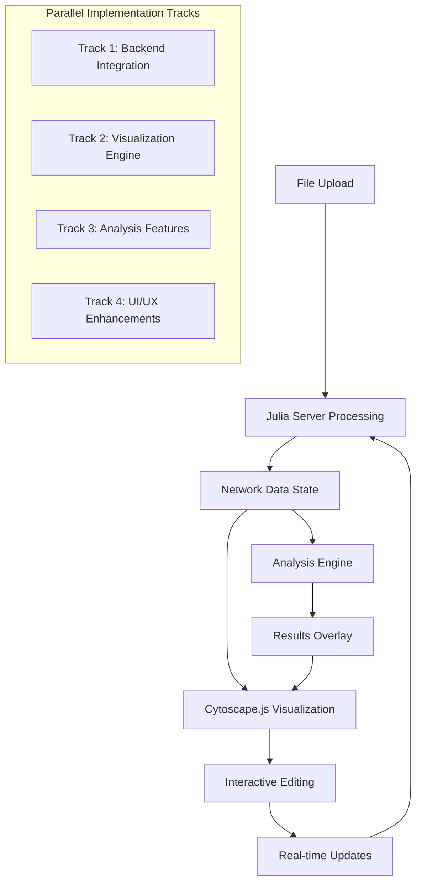

# 🏗️ Comprehensive Implementation Plan: Angular-Julia Integration

## 📋 Executive Summary

This plan transforms the current Angular scaffolding into a fully functional network analysis application with advanced visualization capabilities and seamless Julia backend integration. The implementation will be done in parallel across all major components.

## 🔍 Current State Analysis

### ✅ **Strengths Identified:**
- **Excellent Signal Architecture**: Modern Angular 20 signal-based state management
- **Comprehensive API Service**: Well-defined interfaces matching Julia endpoints
- **Robust State Services**: NetworkStateService, AnalysisStateService, VisualizationStateService
- **File Handling Infrastructure**: FileHandlerService with validation capabilities

### ❌ **Critical Gaps:**
- **No Backend Integration**: Components bypass API service entirely
- **Empty Visualization**: Component has no Cytoscape.js implementation
- **Mock Analysis**: AnalysisStateService uses mock data instead of Julia endpoints
- **Disconnected UI**: File upload doesn't trigger actual processing

## 🎯 Implementation Strategy



## 🚀 Implementation Tracks

### **Track 1: Backend Integration & Connectivity**

#### **1.1 Network Setup Component Integration**
**File:** `website/workspace/apps/network-flow-ui/src/app/pages/network-setup/network-setup.component.ts`

**Current Issue:** Lines 91-126 bypass `NetworkStateService.processUploadedFiles()`

**Changes Required:**
```typescript
// Replace handleFileUpload method
private async handleFileUpload(file: File): Promise<void> {
  try {
    this.networkState.setLoading(true);
    this.uiState.showInfo('Processing File', `Processing ${file.name}...`);

    // Use NetworkStateService API integration instead of local parsing
    const fileType = this.determineFileType(file.name);
    await this.networkState.validateAndUploadFile(file, fileType);
    
    // Process through Julia backend if DAG file
    if (fileType === 'dag') {
      const result = await this.networkState.processUploadedFiles();
      this.uiState.showSuccess(
        'Network Processed',
        `Successfully processed network via Julia backend`
      );
    }
  } catch (error) {
    // Error handling already implemented in NetworkStateService
  }
}
```

#### **1.2 Backend Health Check Integration**
**New Component:** Connection Status Indicator

**Implementation:**
```typescript
// Add to NetworkStateService
private _connectionStatus = signal<'connected' | 'disconnected' | 'checking'>('checking');
readonly connectionStatus = this._connectionStatus.asReadonly();

async checkConnection(): Promise<void> {
  this._connectionStatus.set('checking');
  try {
    await firstValueFrom(this.apiService.testConnection());
    this._connectionStatus.set('connected');
  } catch {
    this._connectionStatus.set('disconnected');
  }
}
```

#### **1.3 Error Handling Enhancement**
**File:** `website/workspace/libs/network-core/src/lib/services/api.service.ts` (Lines 266-307)

**Enhancements:**
- Add retry logic with exponential backoff
- Implement request queuing for concurrent operations
- Add connection pooling for multiple analysis requests

### **Track 2: Advanced Cytoscape.js Visualization Engine**

#### **2.1 Core Visualization Component Implementation**
**File:** `website/workspace/apps/network-flow-ui/src/app/pages/visualization/visualization.component.ts` (Currently empty)

**Complete Implementation Required:**
```typescript
@Component({
  selector: 'app-visualization',
  standalone: true,
  imports: [CommonModule, RouterModule],
  template: `
    <div class="visualization-container">
      <div class="visualization-toolbar">
        <!-- Layout controls, zoom, analysis overlays -->
        <div class="toolbar-section">
          <label>Layout:</label>
          <select (change)="onLayoutChange($event)" [value]="visualizationState.settings().layout">
            <option value="dagre">Dagre (Hierarchical)</option>
            <option value="force-directed">Force Directed</option>
            <option value="circular">Circular</option>
            <option value="grid">Grid</option>
          </select>
        </div>
        
        <div class="toolbar-section">
          <button (click)="zoomIn()" [disabled]="!visualizationState.canZoomIn()">Zoom In</button>
          <button (click)="zoomOut()" [disabled]="!visualizationState.canZoomOut()">Zoom Out</button>
          <button (click)="fitToView()">Fit to View</button>
        </div>
        
        <div class="toolbar-section">
          <label>
            <input type="checkbox" 
                   [checked]="visualizationState.settings().showLabels"
                   (change)="toggleLabels()"> Show Labels
          </label>
          <label>
            <input type="checkbox" 
                   [checked]="visualizationState.settings().showProbabilities"
                   (change)="toggleProbabilities()"> Show Probabilities
          </label>
        </div>
        
        <div class="toolbar-section analysis-controls">
          <button (click)="overlayReachabilityResults()" 
                  [disabled]="!hasReachabilityResults()">
            Overlay Reachability
          </button>
          <button (click)="highlightDiamondStructures()" 
                  [disabled]="!hasDiamondResults()">
            Highlight Diamonds
          </button>
          <button (click)="clearHighlights()">Clear Highlights</button>
        </div>
      </div>
      
      <div #cytoscapeContainer class="cytoscape-container"></div>
      
      <div class="visualization-sidebar" *ngIf="hasSelection()">
        <div class="sidebar-header">
          <h3>Selection Properties</h3>
          <button (click)="clearSelection()">Clear</button>
        </div>
        
        <div class="property-editor" *ngIf="selectedNode()">
          <h4>Node {{ selectedNode()?.id }}</h4>
          <div class="property-group">
            <label>Probability:</label>
            <input type="number" 
                   min="0" max="1" step="0.01"
                   [value]="selectedNode()?.probability || 0"
                   (change)="updateNodeProbability($event)">
          </div>
          <div class="property-group">
            <label>Label:</label>
            <input type="text" 
                   [value]="selectedNode()?.label || ''"
                   (change)="updateNodeLabel($event)">
          </div>
        </div>
        
        <div class="property-editor" *ngIf="selectedEdge()">
          <h4>Edge {{ selectedEdge()?.id }}</h4>
          <div class="property-group">
            <label>Probability:</label>
            <input type="number" 
                   min="0" max="1" step="0.01"
                   [value]="selectedEdge()?.probability || 0"
                   (change)="updateEdgeProbability($event)">
          </div>
        </div>
        
        <div class="analysis-results" *ngIf="analysisState.hasResults()">
          <h4>Analysis Results</h4>
          <div class="result-item" *ngFor="let result of getRelevantResults()">
            <span class="result-label">{{ result.label }}:</span>
            <span class="result-value">{{ result.value | number:'1.3-3' }}</span>
          </div>
        </div>
      </div>
    </div>
  `,
  styleUrls: ['./visualization.component.scss']
})
export class VisualizationComponent implements OnInit, OnDestroy, AfterViewInit {
  @ViewChild('cytoscapeContainer', { static: true }) 
  private cytoscapeContainer!: ElementRef<HTMLDivElement>;
  
  private cy: cytoscape.Core | null = null;
  private readonly networkState = inject(NetworkStateService);
  private readonly visualizationState = inject(VisualizationStateService);
  private readonly analysisState = inject(AnalysisStateService);
  private readonly destroyRef = inject(DestroyRef);
  
  // Computed signals for template
  protected readonly hasSelection = this.visualizationState.hasSelection;
  protected readonly selectedNode = computed(() => {
    const selection = this.visualizationState.selection();
    const nodeId = selection.selectedNodes[0];
    return nodeId ? this.networkState.getNodeById(nodeId) : null;
  });
  
  protected readonly selectedEdge = computed(() => {
    const selection = this.visualizationState.selection();
    const edgeId = selection.selectedEdges[0];
    return edgeId ? this.networkState.getEdgeById(edgeId) : null;
  });
  
  protected readonly hasReachabilityResults = computed(() => 
    !!this.analysisState.currentAnalysis()?.results.reachabilityProbabilities
  );
  
  protected readonly hasDiamondResults = computed(() => 
    !!this.analysisState.currentAnalysis()?.results.diamondStructures
  );

  ngOnInit(): void {
    // Initialize effects for reactive updates
    this.setupReactiveEffects();
  }

  ngAfterViewInit(): void {
    this.initializeCytoscape();
  }

  ngOnDestroy(): void {
    if (this.cy) {
      this.cy.destroy();
    }
  }

  private initializeCytoscape(): void {
    // Import Cytoscape and extensions
    import('cytoscape').then(cytoscape => {
      return Promise.all([
        import('cytoscape-dagre'),
        import('cytoscape-edgehandles'),
        import('cytoscape-node-resize')
      ]).then(([dagre, edgehandles, nodeResize]) => {
        // Register extensions
        cytoscape.use(dagre.default);
        cytoscape.use(edgehandles.default);
        cytoscape.use(nodeResize.default);
        
        // Initialize Cytoscape instance
        this.cy = cytoscape.default({
          container: this.cytoscapeContainer.nativeElement,
          style: this.generateCytoscapeStyles(),
          layout: { name: 'dagre' },
          minZoom: 0.1,
          maxZoom: 3,
          wheelSensitivity: 0.1
        });
        
        this.setupCytoscapeEvents();
        this.setupInteractiveEditing();
        this.loadNetworkData();
        
        this.visualizationState.setInitialized(true);
      });
    }).catch(error => {
      console.error('Failed to initialize Cytoscape:', error);
      this.visualizationState.setError('Failed to load visualization engine');
    });
  }

  private setupReactiveEffects(): void {
    // Effect: Update visualization when network data changes
    effect(() => {
      const networkData = this.networkState.networkData();
      if (networkData && this.cy) {
        this.updateCytoscapeData(networkData);
      }
    }, { injector: this.destroyRef.injector });

    // Effect: Update styles when analysis results change
    effect(() => {
      const results = this.analysisState.currentAnalysis();
      if (results && this.cy) {
        this.updateAnalysisOverlay(results);
      }
    }, { injector: this.destroyRef.injector });

    // Effect: Update layout when settings change
    effect(() => {
      const settings = this.visualizationState.settings();
      if (this.cy) {
        this.applyVisualizationSettings(settings);
      }
    }, { injector: this.destroyRef.injector });
  }

  private setupCytoscapeEvents(): void {
    if (!this.cy) return;

    // Node selection
    this.cy.on('tap', 'node', (event) => {
      const nodeId = parseInt(event.target.id());
      this.visualizationState.selectNode(nodeId, event.originalEvent.ctrlKey);
    });

    // Edge selection
    this.cy.on('tap', 'edge', (event) => {
      const edgeId = event.target.id();
      this.visualizationState.selectEdge(edgeId, event.originalEvent.ctrlKey);
    });

    // Background tap (clear selection)
    this.cy.on('tap', (event) => {
      if (event.target === this.cy) {
        this.visualizationState.clearSelection();
      }
    });

    // Hover effects
    this.cy.on('mouseover', 'node', (event) => {
      const nodeId = parseInt(event.target.id());
      this.visualizationState.setHoveredNode(nodeId);
    });

    this.cy.on('mouseout', 'node', () => {
      this.visualizationState.setHoveredNode(null);
    });

    // Viewport changes
    this.cy.on('zoom pan', () => {
      const zoom = this.cy!.zoom();
      const pan = this.cy!.pan();
      this.visualizationState.setZoom(zoom);
      this.visualizationState.setPan(pan.x, pan.y);
    });
  }

  private setupInteractiveEditing(): void {
    if (!this.cy) return;

    // Enable edge handles for creating new edges
    const edgehandles = this.cy.edgehandles({
      canConnect: (sourceNode: any, targetNode: any) => {
        return !sourceNode.same(targetNode);
      },
      edgeParams: () => ({
        data: { probability: 0.5 }
      }),
      complete: (sourceNode: any, targetNode: any, addedEles: any) => {
        // Add new edge to network state
        const newEdge = {
          id: `${sourceNode.id()}-${targetNode.id()}`,
          source: parseInt(sourceNode.id()),
          target: parseInt(targetNode.id()),
          probability: 0.5
        };
        this.networkState.addEdge(newEdge);
      }
    });

    // Enable node resizing
    this.cy.nodeResize({
      padding: 5,
      undoable: true,
      resizeToContentCueEnabled: false
    });

    // Context menu for advanced operations
    this.cy.on('cxttap', 'node', (event) => {
      this.showContextMenu(event, 'node');
    });

    this.cy.on('cxttap', 'edge', (event) => {
      this.showContextMenu(event, 'edge');
    });
  }

  private updateCytoscapeData(networkData: any): void {
    if (!this.cy) return;

    const elements = [
      ...networkData.nodes.map((node: any) => ({
        data: {
          id: node.id.toString(),
          label: node.label,
          probability: node.probability,
          type: node.type
        }
      })),
      ...networkData.edges.map((edge: any) => ({
        data: {
          id: edge.id,
          source: edge.source.toString(),
          target: edge.target.toString(),
          probability: edge.probability
        }
      }))
    ];

    this.cy.elements().remove();
    this.cy.add(elements);
    this.cy.layout({ name: this.visualizationState.settings().layout }).run();
  }

  private updateAnalysisOverlay(results: any): void {
    if (!this.cy) return;

    // Update node colors based on reachability probabilities
    if (results.results.reachabilityProbabilities) {
      Object.entries(results.results.reachabilityProbabilities).forEach(([nodeId, probability]) => {
        const node = this.cy!.getElementById(nodeId);
        if (node.length > 0) {
          const color = this.probabilityToColor(probability as number);
          node.style('background-color', color);
        }
      });
    }

    // Highlight diamond structures
    if (results.results.diamondStructures) {
      results.results.diamondStructures.forEach((diamond: any, index: number) => {
        const color = this.getDiamondColor(index);
        diamond.nodes.forEach((nodeId: number) => {
          const node = this.cy!.getElementById(nodeId.toString());
          node.style('border-color', color);
          node.style('border-width', 3);
        });
      });
    }
  }

  private generateCytoscapeStyles(): any[] {
    return [
      {
        selector: 'node',
        style: {
          'background-color': '#666',
          'label': 'data(label)',
          'text-valign': 'center',
          'text-halign': 'center',
          'color': '#fff',
          'font-size': '12px',
          'width': '30px',
          'height': '30px'
        }
      },
      {
        selector: 'node:selected',
        style: {
          'border-width': 3,
          'border-color': '#007bff'
        }
      },
      {
        selector: 'node[type="source"]',
        style: {
          'background-color': '#28a745',
          'shape': 'triangle'
        }
      },
      {
        selector: 'node[type="sink"]',
        style: {
          'background-color': '#dc3545',
          'shape': 'square'
        }
      },
      {
        selector: 'edge',
        style: {
          'width': 2,
          'line-color': '#ccc',
          'target-arrow-color': '#ccc',
          'target-arrow-shape': 'triangle',
          'curve-style': 'bezier'
        }
      },
      {
        selector: 'edge:selected',
        style: {
          'line-color': '#007bff',
          'target-arrow-color': '#007bff',
          'width': 3
        }
      },
      {
        selector: '.highlighted',
        style: {
          'background-color': '#ff6b6b',
          'line-color': '#ff6b6b',
          'target-arrow-color': '#ff6b6b',
          'opacity': 0.8
        }
      }
    ];
  }

  // Template event handlers
  protected onLayoutChange(event: Event): void {
    const select = event.target as HTMLSelectElement;
    this.visualizationState.setLayout(select.value as any);
    if (this.cy) {
      this.cy.layout({ name: select.value }).run();
    }
  }

  protected zoomIn(): void {
    this.visualizationState.zoomIn();
    if (this.cy) {
      this.cy.zoom(this.visualizationState.viewport().zoom);
    }
  }

  protected zoomOut(): void {
    this.visualizationState.zoomOut();
    if (this.cy) {
      this.cy.zoom(this.visualizationState.viewport().zoom);
    }
  }

  protected fitToView(): void {
    if (this.cy) {
      this.cy.fit();
      this.visualizationState.fitToView();
    }
  }

  protected toggleLabels(): void {
    this.visualizationState.toggleLabels();
  }

  protected toggleProbabilities(): void {
    this.visualizationState.toggleProbabilities();
  }

  protected overlayReachabilityResults(): void {
    const results = this.analysisState.currentAnalysis();
    if (results?.results.reachabilityProbabilities) {
      this.updateAnalysisOverlay(results);
    }
  }

  protected highlightDiamondStructures(): void {
    const results = this.analysisState.currentAnalysis();
    if (results?.results.diamondStructures) {
      this.updateAnalysisOverlay(results);
    }
  }

  protected clearHighlights(): void {
    this.visualizationState.clearHighlights();
    if (this.cy) {
      this.cy.elements().removeClass('highlighted');
      this.cy.nodes().style({
        'background-color': '#666',
        'border-width': 0
      });
      this.cy.edges().style({
        'line-color': '#ccc',
        'target-arrow-color': '#ccc'
      });
    }
  }

  protected clearSelection(): void {
    this.visualizationState.clearSelection();
  }

  protected updateNodeProbability(event: Event): void {
    const input = event.target as HTMLInputElement;
    const nodeId = this.selectedNode()?.id;
    if (nodeId !== undefined) {
      const probability = parseFloat(input.value);
      this.networkState.updateNodeProbability(nodeId, probability);
    }
  }

  protected updateNodeLabel(event: Event): void {
    const input = event.target as HTMLInputElement;
    const nodeId = this.selectedNode()?.id;
    if (nodeId !== undefined) {
      this.networkState.updateNodeLabel(nodeId, input.value);
    }
  }

  protected updateEdgeProbability(event: Event): void {
    const input = event.target as HTMLInputElement;
    const edgeId = this.selectedEdge()?.id;
    if (edgeId) {
      const probability = parseFloat(input.value);
      this.networkState.updateEdgeProbability(edgeId, probability);
    }
  }

  protected getRelevantResults(): Array<{label: string, value: number}> {
    const results = this.analysisState.currentAnalysis();
    const selection = this.visualizationState.selection();
    const relevantResults: Array<{label: string, value: number}> = [];

    if (results?.results.reachabilityProbabilities && selection.selectedNodes.length > 0) {
      selection.selectedNodes.forEach(nodeId => {
        const probability = results.results.reachabilityProbabilities![nodeId];
        if (probability !== undefined) {
          relevantResults.push({
            label: `Node ${nodeId} Reachability`,
            value: probability
          });
        }
      });
    }

    return relevantResults;
  }

  // Utility methods
  private probabilityToColor(probability: number): string {
    // Convert probability to color (red = low, green = high)
    const red = Math.round(255 * (1 - probability));
    const green = Math.round(255 * probability);
    return `rgb(${red}, ${green}, 0)`;
  }

  private getDiamondColor(index: number): string {
    const colors = ['#ff6b6b', '#4ecdc4', '#45b7d1', '#96ceb4', '#feca57'];
    return colors[index % colors.length];
  }

  private showContextMenu(event: any, type: 'node' | 'edge'): void {
    // Implement context menu for advanced operations
    // This could include delete, duplicate, change type, etc.
  }

  private applyVisualizationSettings(settings: any): void {
    if (!this.cy) return;

    // Apply node size
    this.cy.nodes().style('width', settings.nodeSize);
    this.cy.nodes().style('height', settings.nodeSize);

    // Apply edge width
    this.cy.edges().style('width', settings.edgeWidth);

    // Show/hide labels
    if (settings.showLabels) {
      this.cy.nodes().style('label', 'data(label)');
    } else {
      this.cy.nodes().style('label', '');
    }

    // Show/hide probabilities
    if (settings.showProbabilities) {
      this.cy.edges().style('label', 'data(probability)');
    } else {
      this.cy.edges().style('label', '');
    }
  }

  private loadNetworkData(): void {
    const networkData = this.networkState.networkData();
    if (networkData) {
      this.updateCytoscapeData(networkData);
    }
  }
}
```

#### **2.2 Cytoscape.js Integration Architecture**
**Dependencies to Add:**
```json
{
  "cytoscape": "^3.26.0",
  "cytoscape-dagre": "^2.5.0",
  "cytoscape-cose-bilkent": "^4.1.0",
  "cytoscape-edgehandles": "^4.0.1",
  "cytoscape-node-resize": "^1.0.1",
  "cytoscape-context-menus": "^4.1.0"
}
```

#### **2.3 Visualization Component Styles**
**File:** `website/workspace/apps/network-flow-ui/src/app/pages/visualization/visualization.component.scss`

```scss
.visualization-container {
  display: flex;
  flex-direction: column;
  height: 100vh;
  background: #f8f9fa;
}

.visualization-toolbar {
  display: flex;
  align-items: center;
  gap: 1rem;
  padding: 0.5rem 1rem;
  background: white;
  border-bottom: 1px solid #dee2e6;
  flex-wrap: wrap;

  .toolbar-section {
    display: flex;
    align-items: center;
    gap: 0.5rem;
    padding: 0.25rem 0.5rem;
    border-right: 1px solid #dee2e6;

    &:last-child {
      border-right: none;
    }

    label {
      font-size: 0.875rem;
      font-weight: 500;
      margin: 0;
    }

    select, button {
      padding: 0.25rem 0.5rem;
      border: 1px solid #ced4da;
      border-radius: 0.25rem;
      font-size: 0.875rem;

      &:disabled {
        opacity: 0.6;
        cursor: not-allowed;
      }
    }

    button {
      background: #007bff;
      color: white;
      cursor: pointer;

      &:hover:not(:disabled) {
        background: #0056b3;
      }
    }

    input[type="checkbox"] {
      margin-right: 0.25rem;
    }
  }

  .analysis-controls button {
    background: #28a745;

    &:hover:not(:disabled) {
      background: #1e7e34;
    }
  }
}

.cytoscape-container {
  flex: 1;
  position: relative;
  background: white;
}

.visualization-sidebar {
  position: absolute;
  top: 60px;
  right: 0;
  width: 300px;
  height: calc(100% - 60px);
  background: white;
  border-left: 1px solid #dee2e6;
  overflow-y: auto;
  z-index: 1000;

  .sidebar-header {
    display: flex;
    justify-content: space-between;
    align-items: center;
    padding: 1rem;
    border-bottom: 1px solid #dee2e6;

    h3 {
      margin: 0;
      font-size: 1.1rem;
    }

    button {
      padding: 0.25rem 0.5rem;
      background: #6c757d;
      color: white;
      border: none;
      border-radius: 0.25rem;
      cursor: pointer;

      &:hover {
        background: #545b62;
      }
    }
  }

  .property-editor {
    padding: 1rem;
    border-bottom: 1px solid #dee2e6;

    h4 {
      margin: 0 0 1rem 0;
      font-size: 1rem;
      color: #495057;
    }

    .property-group {
      margin-bottom: 1rem;

      label {
        display: block;
        margin-bottom: 0.25rem;
        font-size: 0.875rem;
        font-weight: 500;
        color: #495057;
      }

      input {
        width: 100%;
        padding: 0.375rem 0.75rem;
        border: 1px solid #ced4da;
        border-radius: 0.25rem;
        font-size: 0.875rem;

        &:focus {
          outline: none;
          border-color: #007bff;
          box-shadow: 0 0 0 0.2rem rgba(0, 123, 255, 0.25);
        }
      }
    }
  }

  .analysis-results {
    padding: 1rem;

    h4 {
      margin: 0 0 1rem 0;
      font-size: 1rem;
      color: #495057;
    }

    .result-item {
      display: flex;
      justify-content: space-between;
      align-items: center;
      padding: 0.5rem 0;
      border-bottom: 1px solid #f8f9fa;

      .result-label {
        font-size: 0.875rem;
        color: #6c757d;
      }

      .result-value {
        font-size: 0.875rem;
        font-weight: 600;
        color: #495057;
      }
    }
  }
}

// Responsive design
@media (max-width: 768px) {
  .visualization-toolbar {
    flex-direction: column;
    align-items: stretch;

    .toolbar-section {
      border-right: none;
      border-bottom: 1px solid #dee2e6;
      justify-content: center;

      &:last-child {
        border-bottom: none;
      }
    }
  }

  .visualization-sidebar {
    width: 100%;
    height: 50%;
    top: auto;
    bottom: 0;
    border-left: none;
    border-top: 1px solid #dee2e6;
  }
}
```

### **Track 3: Analysis Engine Integration**

#### **3.1 Replace Mock Analysis with Julia API Calls**
**File:** `website/workspace/libs/network-core/src/lib/services/analysis-state.service.ts` (Lines 381-441)

**Complete Replacement:**
```typescript
// Replace the entire performAnalysis method
private async performAnalysis(type: AnalysisType): Promise<AnalysisResults['results']> {
  const networkData = this.networkState.networkData();
  if (!networkData) throw new Error('No network data available');

  // Get CSV content from last processing result
  const lastResult = this.networkState.lastProcessingResult();
  if (!lastResult?.processedFiles.dagFile) {
    throw new Error('No processed DAG file available');
  }

  const csvContent = lastResult.processedFiles.dagFile.content;
  const overrides = this._parameterOverrides();