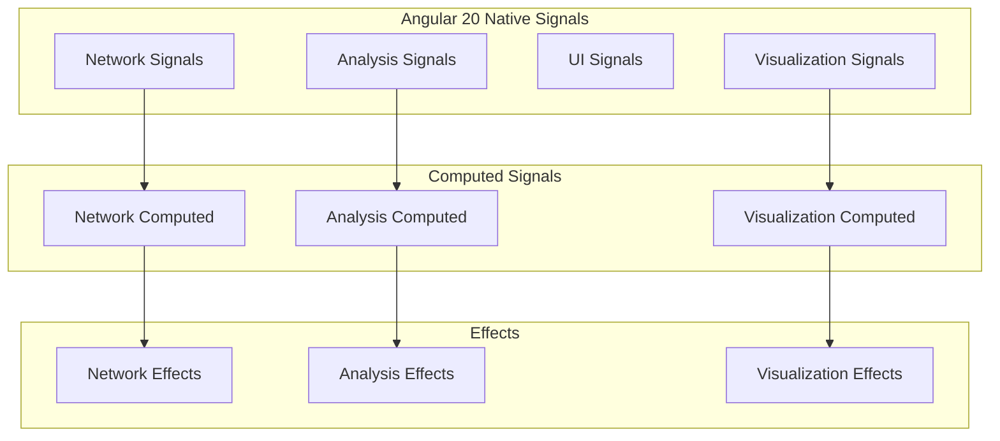

# 🚀 Angular 20 Native Signals Implementation Plan

## 📋 Project Overview - UPDATED

Building a sophisticated Angular 20 network analysis application with:
- **Native Angular 20 Signals** for reactive state management (NO NgRx needed!)
- **Angular Material** with custom muted purple/pink theming
- **Cytoscape.js** for interactive network visualization
- **Nx workspace** with reusable libraries
- **Desktop-first responsive design**

## 🎯 Why Native Signals Over NgRx

### Angular 20 Stabilized Features
```typescript
// All stable in Angular 20
import { 
  signal,           // Reactive state
  computed,         // Derived state
  effect,           // Side effects
  linkedSignal,     // Connected signals
  toSignal          // RxJS bridge
} from '@angular/core';
```

### Perfect for Network Analysis
```typescript
// Network state with native signals
export class NetworkStateService {
  // Core state
  private _networkData = signal<NetworkData | null>(null);
  private _isLoading = signal(false);
  private _error = signal<string | null>(null);
  
  // Public readonly signals
  readonly networkData = this._networkData.asReadonly();
  readonly isLoading = this._isLoading.asReadonly();
  readonly error = this._error.asReadonly();
  
  // Computed derived state
  readonly hasNetwork = computed(() => this._networkData() !== null);
  readonly nodeCount = computed(() => this._networkData()?.nodes.length ?? 0);
  readonly edgeCount = computed(() => this._networkData()?.edges.length ?? 0);
  readonly isReady = computed(() => this.hasNetwork() && !this.isLoading());
  
  // Analysis state
  private _analysisResults = signal<AnalysisResults | null>(null);
  readonly analysisResults = this._analysisResults.asReadonly();
  readonly hasResults = computed(() => this._analysisResults() !== null);
  
  // Methods
  loadNetwork(data: NetworkData) {
    this._networkData.set(data);
    this._error.set(null);
  }
  
  setLoading(loading: boolean) {
    this._isLoading.set(loading);
  }
  
  setError(error: string) {
    this._error.set(error);
    this._isLoading.set(false);
  }
}
```

## 🏗️ Updated Architecture

### State Management Architecture


### Service Layer with Signals
```typescript
// Core services using signals
@Injectable({ providedIn: 'root' })
export class NetworkStateService {
  // Network state signals
  private _networkData = signal<NetworkData | null>(null);
  private _uploadedFiles = signal<UploadedFiles>({});
  private _isProcessing = signal(false);
  
  // Public computed signals
  readonly networkData = this._networkData.asReadonly();
  readonly isNetworkLoaded = computed(() => this._networkData() !== null);
  readonly canAnalyze = computed(() => 
    this.isNetworkLoaded() && !this._isProcessing()
  );
}

@Injectable({ providedIn: 'root' })
export class AnalysisStateService {
  // Analysis state signals
  private _currentAnalysis = signal<AnalysisResults | null>(null);
  private _analysisHistory = signal<AnalysisHistoryItem[]>([]);
  private _isRunning = signal(false);
  
  // Computed analysis state
  readonly currentAnalysis = this._currentAnalysis.asReadonly();
  readonly hasResults = computed(() => this._currentAnalysis() !== null);
  readonly analysisCount = computed(() => this._analysisHistory().length);
}

@Injectable({ providedIn: 'root' })
export class VisualizationStateService {
  // Visualization state signals
  private _selectedNodes = signal<number[]>([]);
  private _highlightedPaths = signal<Path[]>([]);
  private _layoutType = signal<LayoutType>('dagre');
  
  // Computed visualization state
  readonly selectedNodes = this._selectedNodes.asReadonly();
  readonly hasSelection = computed(() => this._selectedNodes().length > 0);
  readonly selectionCount = computed(() => this._selectedNodes().length);
}
```

## 🔧 Implementation Steps

### Phase 1: Clean Foundation (Week 1)

#### 1.1 Remove NgRx Dependencies
```bash
# Remove NgRx (no longer needed!)
npm uninstall @ngrx/store @ngrx/effects @ngrx/store-devtools @ngrx/router-store
```

#### 1.2 Verify Angular 20 Installation
```bash
# Check versions
npm list @angular/core @angular/material cytoscape
```

#### 1.3 Create Nx Libraries
```bash
# Generate shared libraries
nx generate @nx/angular:library ui-components --directory=libs/ui-components --importPath=@network-analysis/ui-components --standalone
nx generate @nx/angular:library network-core --directory=libs/network-core --importPath=@network-analysis/network-core --standalone
nx generate @nx/angular:library visualization --directory=libs/visualization --importPath=@network-analysis/visualization --standalone
```

### Phase 2: Signal-Based Services (Week 2)

#### 2.1 Core State Services
```typescript
// libs/network-core/src/lib/services/network-state.service.ts
@Injectable({ providedIn: 'root' })
export class NetworkStateService {
  // Private signals for internal state
  private _networkData = signal<NetworkData | null>(null);
  private _isLoading = signal(false);
  private _error = signal<string | null>(null);
  private _uploadedFiles = signal<UploadedFiles>({});
  
  // Public readonly signals
  readonly networkData = this._networkData.asReadonly();
  readonly isLoading = this._isLoading.asReadonly();
  readonly error = this._error.asReadonly();
  readonly uploadedFiles = this._uploadedFiles.asReadonly();
  
  // Computed signals
  readonly isNetworkLoaded = computed(() => this._networkData() !== null);
  readonly nodeCount = computed(() => this._networkData()?.nodes.length ?? 0);
  readonly edgeCount = computed(() => this._networkData()?.edges.length ?? 0);
  readonly canAnalyze = computed(() => 
    this.isNetworkLoaded() && !this.isLoading() && !this.error()
  );
  
  // Effects for side effects
  constructor() {
    // Auto-save effect
    effect(() => {
      const data = this._networkData();
      if (data) {
        this.saveToLocalStorage(data);
      }
    });
    
    // Error logging effect
    effect(() => {
      const error = this._error();
      if (error) {
        console.error('Network error:', error);
      }
    });
  }
  
  // State mutation methods
  loadNetwork(data: NetworkData): void {
    this._networkData.set(data);
    this._error.set(null);
  }
  
  setLoading(loading: boolean): void {
    this._isLoading.set(loading);
  }
  
  setError(error: string): void {
    this._error.set(error);
    this._isLoading.set(false);
  }
  
  addUploadedFile(type: FileType, file: File): void {
    this._uploadedFiles.update(files => ({
      ...files,
      [type]: file
    }));
  }
  
  clearNetwork(): void {
    this._networkData.set(null);
    this._uploadedFiles.set({});
    this._error.set(null);
  }
  
  private saveToLocalStorage(data: NetworkData): void {
    try {
      localStorage.setItem('network-data', JSON.stringify(data));
    } catch (error) {
      console.warn('Failed to save to localStorage:', error);
    }
  }
}
```

#### 2.2 Analysis State Service
```typescript
// libs/network-core/src/lib/services/analysis-state.service.ts
@Injectable({ providedIn: 'root' })
export class AnalysisStateService {
  private _currentAnalysis = signal<AnalysisResults | null>(null);
  private _analysisHistory = signal<AnalysisHistoryItem[]>([]);
  private _isRunning = signal(false);
  private _parameters = signal<AnalysisParameters>({});
  
  readonly currentAnalysis = this._currentAnalysis.asReadonly();
  readonly analysisHistory = this._analysisHistory.asReadonly();
  readonly isRunning = this._isRunning.asReadonly();
  readonly parameters = this._parameters.asReadonly();
  
  readonly hasResults = computed(() => this._currentAnalysis() !== null);
  readonly analysisCount = computed(() => this._analysisHistory().length);
  readonly canRunAnalysis = computed(() => !this.isRunning());
  
  constructor(private networkState: NetworkStateService) {
    // Auto-run analysis when network changes
    effect(() => {
      const network = this.networkState.networkData();
      if (network && this.parameters()) {
        this.runAnalysis();
      }
    });
  }
  
  setParameters(params: AnalysisParameters): void {
    this._parameters.set(params);
  }
  
  async runAnalysis(): Promise<void> {
    if (!this.networkState.canAnalyze()) return;
    
    this._isRunning.set(true);
    try {
      const results = await this.performAnalysis();
      this._currentAnalysis.set(results);
      this.addToHistory(results);
    } catch (error) {
      console.error('Analysis failed:', error);
    } finally {
      this._isRunning.set(false);
    }
  }
  
  private addToHistory(results: AnalysisResults): void {
    this._analysisHistory.update(history => [
      ...history,
      {
        id: crypto.randomUUID(),
        timestamp: new Date(),
        results,
        parameters: this._parameters()
      }
    ]);
  }
  
  private async performAnalysis(): Promise<AnalysisResults> {
    // Implementation for API calls
    return {} as AnalysisResults;
  }
}
```

### Phase 3: Component Integration (Week 3)

#### 3.1 Signal-Based Components
```typescript
// Component using signals
@Component({
  selector: 'app-network-setup',
  template: `
    <div class="network-setup">
      <h2>Network Setup</h2>
      
      <!-- Loading state -->
      @if (networkState.isLoading()) {
        <app-loading-spinner message="Processing network data..." />
      }
      
      <!-- Error state -->
      @if (networkState.error(); as error) {
        <app-error-message [message]="error" />
      }
      
      <!-- File upload -->
      <app-file-upload 
        (fileSelected)="onFileSelected($event)"
        [disabled]="networkState.isLoading()" />
      
      <!-- Network preview -->
      @if (networkState.isNetworkLoaded()) {
        <app-network-preview 
          [networkData]="networkState.networkData()!"
          [nodeCount]="networkState.nodeCount()"
          [edgeCount]="networkState.edgeCount()" />
      }
      
      <!-- Analysis button -->
      @if (networkState.canAnalyze()) {
        <button 
          mat-raised-button 
          color="primary"
          (click)="startAnalysis()">
          Start Analysis
        </button>
      }
    </div>
  `,
  standalone: true,
  imports: [CommonModule, MaterialModule, /* other imports */]
})
export class NetworkSetupComponent {
  constructor(
    protected networkState: NetworkStateService,
    private analysisState: AnalysisStateService
  ) {}
  
  onFileSelected(file: File): void {
    this.networkState.setLoading(true);
    // Process file...
  }
  
  startAnalysis(): void {
    this.analysisState.runAnalysis();
  }
}
```

### Phase 4: Visualization with Signals (Week 4)

#### 4.1 Cytoscape Integration
```typescript
// libs/visualization/src/lib/services/cytoscape.service.ts
@Injectable({ providedIn: 'root' })
export class CytoscapeService {
  private _cy = signal<cytoscape.Core | null>(null);
  private _selectedNodes = signal<string[]>([]);
  private _layout = signal<LayoutType>('dagre');
  
  readonly cy = this._cy.asReadonly();
  readonly selectedNodes = this._selectedNodes.asReadonly();
  readonly layout = this._layout.asReadonly();
  
  readonly hasSelection = computed(() => this._selectedNodes().length > 0);
  readonly selectionCount = computed(() => this._selectedNodes().length);
  
  constructor(private networkState: NetworkStateService) {
    // Auto-update visualization when network changes
    effect(() => {
      const networkData = this.networkState.networkData();
      const cy = this._cy();
      
      if (networkData && cy) {
        this.updateVisualization(networkData, cy);
      }
    });
  }
  
  initializeCytoscape(container: HTMLElement): void {
    const cy = cytoscape({
      container,
      style: this.getStyles(),
      layout: { name: this._layout() }
    });
    
    this.setupEventHandlers(cy);
    this._cy.set(cy);
  }
  
  private setupEventHandlers(cy: cytoscape.Core): void {
    cy.on('select', 'node', (event) => {
      const selectedIds = cy.$('node:selected').map(node => node.id());
      this._selectedNodes.set(selectedIds);
    });
  }
  
  setLayout(layout: LayoutType): void {
    this._layout.set(layout);
    const cy = this._cy();
    if (cy) {
      cy.layout({ name: layout }).run();
    }
  }
}
```

## 🎨 Benefits of This Approach

### 1. **No Dependency Conflicts**
- Pure Angular 20 - no NgRx peer dependency issues
- Clean, modern codebase

### 2. **Better Performance**
- Granular reactivity with signals
- Automatic change detection optimization
- Minimal re-renders

### 3. **Simpler Architecture**
- Less boilerplate than NgRx
- More intuitive state management
- Easier to understand and maintain

### 4. **Cutting-Edge for PhD**
- Shows mastery of latest Angular features
- Demonstrates forward-thinking approach
- Professional, modern codebase

### 5. **Perfect for Network Analysis**
- Reactive network data updates
- Computed analysis results
- Real-time visualization updates
- Efficient state synchronization

## 🚀 Next Steps

1. **Remove NgRx dependencies** - Clean slate approach
2. **Verify Angular 20 setup** - Ensure all packages compatible
3. **Create Nx libraries** - Modular architecture
4. **Implement signal services** - Core state management
5. **Build components** - Signal-based reactive UI
6. **Integrate Cytoscape** - Visualization with signals

This approach gives you a cutting-edge, professional application that showcases the latest Angular 20 capabilities while avoiding dependency conflicts entirely!