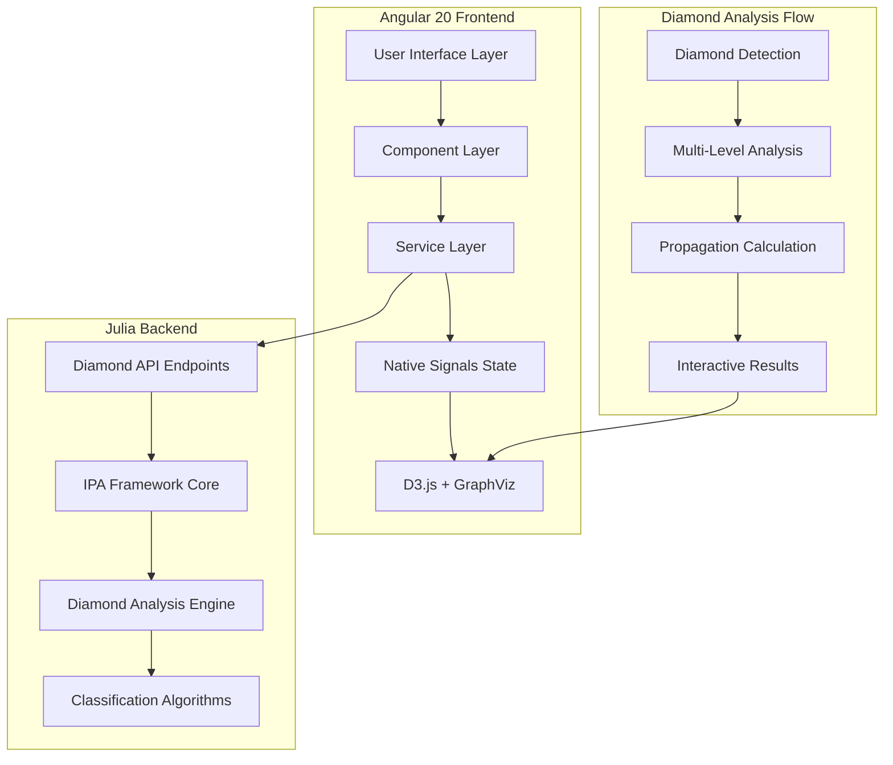
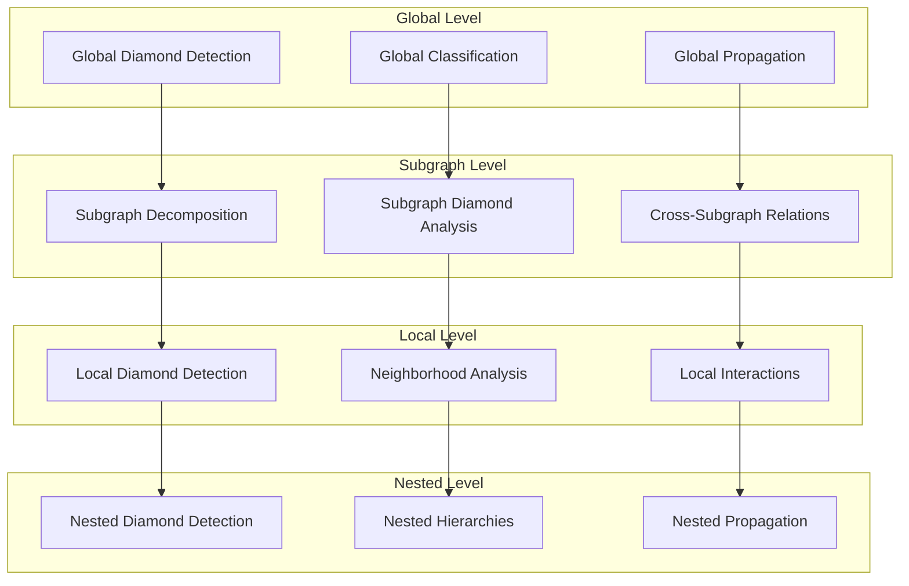

# 🏗️ Angular 20 Network Analysis Application - Architecture Plan

## 📋 Executive Summary

This document outlines the technical architecture for a sophisticated Angular 20 network analysis application that integrates with a Julia backend for comprehensive diamond structure analysis and classification. The application leverages Angular 20 Native Signals for state management, D3.js with GraphViz for interactive visualization, and provides multi-level diamond analysis capabilities.

### Key Architectural Features
- **Angular 20 Native Signals**: Modern reactive state management without NgRx dependencies
- **Diamond Analysis Focus**: Detection, classification, multi-level analysis, and propagation calculations
- **D3.js + GraphViz Visualization**: Advanced network visualization with interactive controls
- **Julia Backend Integration**: Seamless API communication for diamond processing
- **Responsive Design**: Desktop-first approach optimized for network analysis workflows
- **Modular Nx Architecture**: Scalable library structure for maintainability

---

## 🏗️ System Architecture Overview



### Technology Stack
- **Frontend**: Angular 20, Native Signals, TypeScript 5.8
- **Visualization**: D3.js, GraphViz (DOT, Circo, FDP, Neato)
- **Build System**: Nx 21.2.2
- **Styling**: SCSS, Custom Design System
- **Backend Integration**: Julia IPA Framework with Diamond Analysis
- **Storage**: LocalStorage, IndexedDB for persistence

---

## 📁 Project Structure

```
website/workspace/
├── apps/
│   └── network-flow-ui/                    # Main Angular Application
│       ├── src/app/
│       │   ├── pages/                      # Feature Pages
│       │   │   ├── network-setup/          # Network Setup & Upload
│       │   │   ├── visualization/          # D3.js Visualization
│       │   │   ├── diamond-analysis/       # Diamond Analysis Dashboard
│       │   │   └── multi-level-explorer/   # Multi-Level Analysis
│       │   ├── components/                 # Shared Components
│       │   │   ├── diamond-viewer/         # Diamond Structure Display
│       │   │   ├── analysis-controls/      # Analysis Parameter Controls
│       │   │   ├── results-panel/          # Analysis Results Display
│       │   │   └── classification-tree/    # Diamond Classification Tree
│       │   └── app.routes.ts               # Routing Configuration
├── libs/                                   # Shared Libraries
│   ├── network-core/                       # Core Data & Services
│   │   ├── models/                         # Data Models
│   │   │   ├── network.models.ts           # Network Data Structures
│   │   │   ├── diamond.models.ts           # Diamond Analysis Models
│   │   │   └── api.models.ts               # API Interface Models
│   │   └── services/                       # State Services
│   │       ├── network-state.service.ts    # Network Data Management
│   │       ├── analysis-state.service.ts   # Analysis Execution
│   │       ├── diamond-state.service.ts    # Diamond Analysis State
│   │       ├── api.service.ts              # Julia API Client
│   │       └── app-state.service.ts        # Global Coordination
│   ├── ui-components/                      # Reusable UI Components
│   │   ├── file-upload/                    # File Upload Component
│   │   ├── parameter-editor/               # Analysis Parameter Editor
│   │   ├── progress-indicator/             # Analysis Progress Display
│   │   └── data-table/                     # Results Data Table
│   └── visualization/                      # Visualization Components
│       ├── services/
│       │   └── visualization-state.service.ts # D3.js State Management
│       └── components/
│           ├── network-graph/              # Main Graph Component
│           ├── diamond-overlay/            # Diamond Highlighting
│           └── interactive-controls/       # Zoom, Pan, Layout Controls
```

---

## 🔧 Angular 20 Native Signals Architecture

### Core State Management Pattern

```typescript
// Service Pattern with Native Signals
@Injectable({ providedIn: 'root' })
export class DiamondStateService {
  // Private signals for internal state
  private _diamondStructures = signal<DiamondStructure[]>([]);
  private _classifications = signal<DiamondClassification[]>([]);
  private _analysisLevel = signal<AnalysisLevel>('global');
  private _isAnalyzing = signal(false);
  
  // Public readonly signals
  readonly diamondStructures = this._diamondStructures.asReadonly();
  readonly classifications = this._classifications.asReadonly();
  readonly analysisLevel = this._analysisLevel.asReadonly();
  readonly isAnalyzing = this._isAnalyzing.asReadonly();
  
  // Computed signals for derived state
  readonly diamondCount = computed(() => this._diamondStructures().length);
  readonly classificationSummary = computed(() => 
    this._classifications().reduce((acc, c) => {
      acc[c.type] = (acc[c.type] || 0) + 1;
      return acc;
    }, {} as Record<string, number>)
  );
  
  readonly canAnalyze = computed(() => 
    !this._isAnalyzing() && this.networkState.isNetworkLoaded()
  );
  
  // Effects for side effects and coordination
  constructor(private networkState: NetworkStateService) {
    effect(() => {
      const structures = this._diamondStructures();
      if (structures.length > 0) {
        this.updateVisualizationHighlights(structures);
      }
    });
  }
}
```

### Component Integration Pattern

```typescript
@Component({
  selector: 'app-diamond-analysis',
  template: `
    <!-- Angular 20 Control Flow Syntax -->
    @if (diamondState.isAnalyzing()) {
      <app-progress-indicator 
        [message]="'Analyzing diamond structures...'"
        [progress]="analysisProgress()" />
    }
    
    @if (diamondState.diamondCount() > 0) {
      <div class="diamond-results">
        <h3>Found {{ diamondState.diamondCount() }} Diamond Structures</h3>
        
        @for (diamond of diamondState.diamondStructures(); track diamond.id) {
          <app-diamond-card 
            [diamond]="diamond"
            [classification]="getClassification(diamond.id)"
            (drillDown)="exploreDiamond($event)" />
        }
      </div>
    }
  `,
  standalone: true
})
export class DiamondAnalysisComponent {
  protected readonly diamondState = inject(DiamondStateService);
  protected readonly analysisState = inject(AnalysisStateService);
  
  // Computed signals for template
  protected readonly analysisProgress = computed(() => 
    this.analysisState.currentAnalysis()?.progress || 0
  );
}
```

---

## 🔍 Diamond Analysis Architecture

### Diamond Analysis Models

```typescript
export interface DiamondStructure {
  id: string;
  nodes: number[];
  sourceNode: number;
  forkNodes: number[];
  joinNodes: number[];
  sinkNode: number;
  level: number;
  parentDiamondId?: string;
  childDiamondIds: string[];
  
  // Analysis properties
  propagationProbability: number;
  criticalPath: number[];
  redundancyFactor: number;
  
  // Geometric properties
  depth: number;
  width: number;
  complexity: DiamondComplexity;
}

export interface DiamondClassification {
  diamondId: string;
  type: DiamondType;
  subtype: DiamondSubtype;
  confidence: number;
  characteristics: DiamondCharacteristics;
  
  // Classification metadata
  algorithm: string;
  timestamp: Date;
  parameters: Record<string, any>;
}

export type DiamondType = 
  | 'simple' 
  | 'nested' 
  | 'overlapping' 
  | 'cascade' 
  | 'parallel';

export type DiamondSubtype = 
  | 'symmetric' 
  | 'asymmetric' 
  | 'weighted' 
  | 'uniform' 
  | 'complex';

export type AnalysisLevel = 
  | 'global' 
  | 'subgraph' 
  | 'local' 
  | 'nested';

export interface MultiLevelAnalysis {
  globalDiamonds: DiamondStructure[];
  subgraphAnalysis: SubgraphDiamondAnalysis[];
  localAnalysis: LocalDiamondAnalysis[];
  nestedAnalysis: NestedDiamondAnalysis[];
  
  // Cross-level relationships
  hierarchicalRelations: DiamondHierarchy[];
  propagationPaths: PropagationPath[];
}
```

### Julia API Integration

```typescript
@Injectable({ providedIn: 'root' })
export class DiamondApiService {
  private readonly baseUrl = environment.juliaApiUrl;
  
  // Diamond detection endpoints
  async detectDiamonds(networkData: NetworkData): Promise<DiamondStructure[]> {
    return firstValueFrom(
      this.http.post<DiamondStructure[]>(`${this.baseUrl}/diamonds/detect`, {
        adjacency_matrix: networkData.adjacencyMatrix,
        node_probabilities: networkData.nodeProbabilities,
        edge_probabilities: networkData.edgeProbabilities
      })
    );
  }
  
  // Diamond classification
  async classifyDiamonds(diamonds: DiamondStructure[]): Promise<DiamondClassification[]> {
    return firstValueFrom(
      this.http.post<DiamondClassification[]>(`${this.baseUrl}/diamonds/classify`, {
        diamond_structures: diamonds
      })
    );
  }
  
  // Multi-level analysis
  async performMultiLevelAnalysis(
    networkData: NetworkData, 
    analysisLevel: AnalysisLevel
  ): Promise<MultiLevelAnalysis> {
    return firstValueFrom(
      this.http.post<MultiLevelAnalysis>(`${this.baseUrl}/diamonds/multi-level`, {
        network_data: networkData,
        analysis_level: analysisLevel,
        include_nested: true,
        include_propagation: true
      })
    );
  }
  
  // Propagation calculation
  async calculatePropagation(
    diamonds: DiamondStructure[],
    parameters: PropagationParameters
  ): Promise<PropagationResults> {
    return firstValueFrom(
      this.http.post<PropagationResults>(`${this.baseUrl}/diamonds/propagation`, {
        diamond_structures: diamonds,
        parameters
      })
    );
  }
}
```

---

## 🎨 D3.js + GraphViz Visualization Architecture

### Visualization Enhancement for Diamond Analysis

```typescript
@Injectable({ providedIn: 'root' })
export class DiamondVisualizationService {
  private readonly visualizationState = inject(VisualizationStateService);
  
  // Diamond-specific visualization methods
  highlightDiamondStructures(diamonds: DiamondStructure[]): void {
    diamonds.forEach((diamond, index) => {
      const color = this.getDiamondColor(diamond.type, index);
      
      // Highlight diamond nodes
      this.visualizationState.highlightNodes(diamond.nodes, color);
      
      // Highlight diamond edges
      const diamondEdges = this.getDiamondEdges(diamond);
      this.visualizationState.highlightEdges(diamondEdges, color);
      
      // Add diamond overlay
      this.addDiamondOverlay(diamond, color);
    });
  }
  
  // Generate enhanced DOT notation with diamond highlighting
  generateDiamondDotString(
    networkData: NetworkData, 
    diamonds: DiamondStructure[]
  ): string {
    let dot = `digraph G {\n`;
    dot += `  layout=dot;\n`;
    dot += `  rankdir=TB;\n`;
    dot += `  compound=true;\n\n`;
    
    // Create subgraphs for each diamond
    diamonds.forEach((diamond, index) => {
      dot += `  subgraph cluster_diamond_${index} {\n`;
      dot += `    label="Diamond ${index + 1} (${diamond.type})";\n`;
      dot += `    style=filled;\n`;
      dot += `    fillcolor="${this.getDiamondColor(diamond.type, index)}";\n`;
      dot += `    alpha=0.3;\n`;
      
      diamond.nodes.forEach(nodeId => {
        const node = networkData.nodes.find(n => n.id === nodeId);
        if (node) {
          dot += `    "${nodeId}" [${this.getDiamondNodeStyle(node, diamond)}];\n`;
        }
      });
      
      dot += `  }\n\n`;
    });
    
    // Add regular nodes and edges
    networkData.nodes.forEach(node => {
      if (!this.isNodeInAnyDiamond(node.id, diamonds)) {
        dot += `  "${node.id}" [${this.getNodeStyle(node)}];\n`;
      }
    });
    
    networkData.edges.forEach(edge => {
      const edgeStyle = this.getEnhancedEdgeStyle(edge, diamonds);
      dot += `  "${edge.source}" -> "${edge.target}" [${edgeStyle}];\n`;
    });
    
    dot += '}\n';
    return dot;
  }
  
  // Interactive diamond exploration
  enableDiamondInteraction(): void {
    // Add click handlers for diamond drill-down
    // Add hover effects for diamond highlighting
    // Add context menus for diamond analysis
  }
}
```

---

## 🔄 Multi-Level Analysis Architecture

### Hierarchical Analysis Flow



### Analysis Coordination Service

```typescript
@Injectable({ providedIn: 'root' })
export class MultiLevelAnalysisService {
  private readonly diamondState = inject(DiamondStateService);
  private readonly apiService = inject(DiamondApiService);
  
  async performComprehensiveAnalysis(
    networkData: NetworkData
  ): Promise<MultiLevelAnalysis> {
    // Phase 1: Global Analysis
    const globalDiamonds = await this.apiService.detectDiamonds(networkData);
    const globalClassifications = await this.apiService.classifyDiamonds(globalDiamonds);
    
    // Phase 2: Subgraph Analysis
    const subgraphs = this.decomposeIntoSubgraphs(networkData, globalDiamonds);
    const subgraphAnalysis = await Promise.all(
      subgraphs.map(sg => this.analyzeSubgraph(sg))
    );
    
    // Phase 3: Local Analysis
    const localAnalysis = await this.performLocalAnalysis(
      networkData, 
      globalDiamonds
    );
    
    // Phase 4: Nested Analysis
    const nestedAnalysis = await this.detectNestedDiamonds(
      globalDiamonds,
      subgraphAnalysis
    );
    
    // Phase 5: Integration
    return this.integrateAnalysisResults({
      globalDiamonds,
      globalClassifications,
      subgraphAnalysis,
      localAnalysis,
      nestedAnalysis
    });
  }
}
```

---

## 🎯 Implementation Priorities

### Phase 1: Diamond Detection Enhancement
- Integrate Julia diamond detection API
- Enhance visualization with diamond highlighting
- Add diamond structure display components

### Phase 2: Classification System
- Implement diamond classification algorithms
- Create classification visualization
- Add classification confidence indicators

### Phase 3: Multi-Level Analysis
- Build hierarchical analysis framework
- Create drill-down navigation
- Implement cross-level relationship mapping

### Phase 4: Interactive Exploration
- Add diamond-specific interaction modes
- Implement propagation path visualization
- Create analysis comparison tools

---

## 🔧 Technical Specifications

### Performance Requirements
- **Network Size**: Support networks up to 10,000 nodes
- **Diamond Detection**: Sub-second response for networks < 1,000 nodes
- **Visualization**: Smooth 60fps rendering with D3.js
- **Memory Usage**: < 500MB for typical analysis sessions

### Browser Compatibility
- **Primary**: Chrome 120+, Firefox 120+, Safari 17+
- **Responsive**: Desktop-first (1200px+), tablet support (768px+)
- **Features**: ES2022, WebGL for large networks, Web Workers for analysis

### API Integration
- **Protocol**: RESTful HTTP with JSON payloads
- **Authentication**: Token-based authentication
- **Error Handling**: Comprehensive error recovery and retry logic
- **Caching**: Intelligent result caching with invalidation

This architecture provides a solid foundation for implementing comprehensive diamond analysis capabilities while maintaining the modern Angular 20 signals approach and leveraging the existing D3.js + GraphViz visualization system.