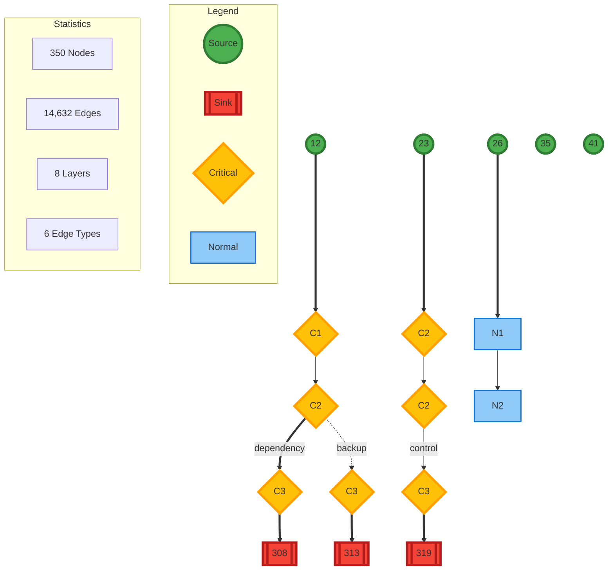

```mermaid
graph TD
    %% Style definitions
    classDef source fill:#4CAF50,stroke:#2E7D32,stroke-width:4px
    classDef sink fill:#F44336,stroke:#B71C1C,stroke-width:4px
    classDef critical fill:#FFC107,stroke:#FFA000,stroke-width:4px
    classDef normal fill:#90CAF9,stroke:#1976D2,stroke-width:2px

    %% Source nodes with distinctive shapes
    S12((12))
    S23((23))
    S26((26))
    S35((35))
    S41((41))

    %% Layer nodes with connections
    L1C1{C1} --> L2C1{C2}
    L1C2{C2} --> L2C2{C2}
    L1N1[N1] --> L2N1[N2]

    %% Edge types with different line styles
    L2C1 ==>|dependency| L3C1{C3}
    L2C1 -.->|backup| L3C2{C3}
    L2C2 -->|control| L3C3{C3}
    
    %% Sink nodes
    SK308[[308]]
    SK313[[313]]
    SK319[[319]]

    %% Source connections
    S12 ==> L1C1
    S23 ==> L1C2
    S26 ==> L1N1

    %% Sink connections
    L3C1 ==> SK308
    L3C2 ==> SK313
    L3C3 ==> SK319

    %% Style applications
    class S12,S23,S26,S35,S41 source
    class SK308,SK313,SK319 sink
    class L1C1,L1C2,L2C1,L2C2,L3C1,L3C2,L3C3 critical
    class L1N1,L2N1 normal

    %% Legend subgraph
    subgraph Legend
        SRC((Source))
        SNK[[Sink]]
        CRT{Critical}
        NRM[Normal]
    end

    class SRC source
    class SNK sink
    class CRT critical
    class NRM normal

    %% Statistics subgraph
    subgraph Statistics
        STAT1["350 Nodes"]
        STAT2["14,632 Edges"]
        STAT3["8 Layers"]
        STAT4["6 Edge Types"]
    end
    
```